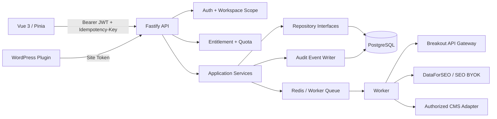
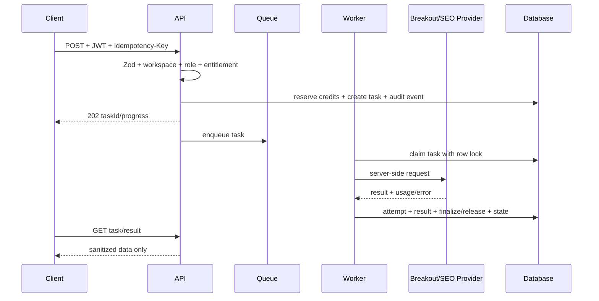

# PH2-03 架构、数据与 API 契约核检

> 文件状态：已批准，基础实现完成 v1.2
> 建立日期：2026-09-13
> 批准人：Product Owner（使用者）
> 批准时间：2026-09-13（当前会话）
> 前置批准：`APPROVE PH2-00`、`APPROVE PH2-01`、`APPROVE PH2-02`
> 依据：`docs/rankwoven-phase-2-prd.md`、`docs/rankwoven-phase-2-development-workflow.md`
> Provider 决策：`docs/approvals/phase-2/PH2-02-provider-selection.md`
> AI gateway：`docs/breakout-api-integration.md`

## 1. 范围与成功标准

本步锁定 Phase 2A 的架构、PostgreSQL 数据模型、REST API／Zod 契约、异步任务状态机、幂等、事件审计、权限边界与测试策略。设计阶段不执行 migration、不启用生产 Provider、不开放 CMS 写入，也不实现前端页面；批准后按第 11 节顺序开始基础契约实现。

完成标准：

- 研究、内容优化、用量、权限与任务数据可以追溯到 workspace、site、provider、gateway model、prompt／rules／schema 版本及成本。
- 所有新表由版本化 migration 建立，不能由 route handler 执行 DDL；migration 可在空库和当前 schema 重复执行或安全跳过。
- 长任务统一返回 `202 Accepted`、`taskId`、`status`、`progress`、`estimatedCredits`，失败、取消、partial、expired、dead-letter 都有明确定义。
- API 服务器端验证 workspace／site／project 归属、role、Entitlement、配额及 `Idempotency-Key`；前端不承担唯一权限控制。
- AI 只经单一 Breakout gateway，模型只来自同步并通过 capability smoke 的 catalog；SEO 数据 Provider 与 AI gateway 不混用。
- 不返回 API key、OAuth token、CMS credential、完整私密 payload 或未经消毒的 HTML。

## 2. 现有底座与接入边界

| 现有模块                          | 可复用能力                                                              | PH2-03 接入方式                                                                                                |
| --------------------------------- | ----------------------------------------------------------------------- | -------------------------------------------------------------------------------------------------------------- |
| `apps/api/src/server.ts`          | Fastify、CORS、全局 rate limit、route registration、Repository 注入     | 保留 composition root；新服务由依赖注入传入，不在 route 内读取秘密或建表                                       |
| `apps/api/src/auth.ts`            | JWT 验证、workspace／role、InMemory 与 Postgres auth repository         | 所有 customer/admin API 使用 `requireAuth`；resource query 必须再做 workspace scope                            |
| `apps/api/src/siteConnections.ts` | site 归属、WordPress credential 加密、sync task、分页 Repository        | 新 project／run 通过 `site_id` 关联；复用 credential secret 边界，不复制密码                                   |
| `apps/api/src/seoOptimization.ts` | audit、issue、suggestion、snapshot、apply／rollback                     | Content Optimizer 复用现有 SEO rules 与快照，不建立第二套建议状态                                              |
| `apps/api/src/siteAudit.ts`       | Site Audit config／result／issue、SerpApi quota                         | PH2-03 只增加任务与 remediation contract，不重建扫描器                                                         |
| `apps/worker/src/index.ts`        | PostgreSQL `FOR UPDATE SKIP LOCKED`、retry、dead-letter、WordPress 写回 | 新任务类型使用同一 claim／attempt 语义；耗时 Provider 请求放 Worker                                            |
| `packages/ai-providers`           | OpenAI 相容文字 adapter、usage record、成本 helper                      | 增加单一 `AiGatewayAdapter` contract；不再增加上游直连 provider                                                |
| `apps/web/src/api`                | 统一 API response、token、AbortController、类型                         | PH2-03 只提供类型与 endpoint contract；页面实现留给 PH2-08                                                     |
| PostgreSQL／Redis                 | 现有 migration runner、队列与持久化                                     | migration 追加 `0010_phase2_contracts.sql`、`0011_phase2_integrity.sql`、`0012_gateway_model_profiles.sql`；Redis 只保存短期队列／锁，不作事实来源 |

## 3. 分层架构



职责约束：

1. Route／Controller：解析 HTTP、验证 Zod、调用 service、映射统一 response；不得写 SQL 或直接调用外部 Provider。
2. Service：执行业务规则、workspace scope、状态转换、幂等、quota reservation 与事件写入；不得依赖 Fastify request／reply。
3. Repository：只处理参数化 SQL、分页、唯一约束与 transaction；不决定 Provider 路由或权限。
4. Worker：执行异步 Provider／CMS 操作，保存 attempt、cost、partial result 与错误；不得绕过 service 状态机。
5. Adapter：把外部协议映射为内部 contract；原始响应只进入受控 raw response reference，不把秘密写入日志。

## 4. Provider Adapter 契约

### 4.1 SEO 数据

```ts
interface SeoMetricsProvider {
  readonly id: 'dataforseo' | 'ahrefs' | 'semrush';
  getCapabilities(): Promise<SeoProviderCapabilities>;
  discoverKeywords(input: KeywordDiscoveryInput): Promise<KeywordDiscoveryResult>;
  getCompetitorKeywords(input: CompetitorKeywordInput): Promise<CompetitorKeywordResult>;
  getBacklinkOpportunities(input: BacklinkOpportunityInput): Promise<BacklinkOpportunityResult>;
}
```

每个结果必须包含 `provider`、`endpoint`、`providerRequestId`（如有）、`collectedAt`、`providerUpdatedAt`、`location`、`language`、`device`、`sourceType`、`isEstimated`、`units`、`estimatedCost` 及分页游标。单个研究 run 只能绑定一个 canonical SEO Provider；不得把 DataForSEO、Ahrefs、Semrush 的难度／权威／流量字段合成一个数值。

### 4.2 单一 Breakout AI gateway

```ts
interface AiGatewayAdapter {
  readonly gateway: 'wenwen';
  listModels(): Promise<GatewayModel[]>;
  generateText(input: GatewayTextRequest): Promise<GatewayTextResult>;
  createEmbedding(input: GatewayEmbeddingRequest): Promise<GatewayEmbeddingResult>;
  generateImage(input: GatewayImageRequest): Promise<GatewayImageResult>;
}
```

约束：

- 固定使用 `WENWEN_API_BASE_URL` 与 server-side `WENWEN_API_KEY`。
- `listModels()` 从 `GET /v1/models` 同步 `id`、`owned_by`、`supported_endpoint_types`；catalog 是动态资料。
- 文字使用 `POST /v1/chat/completions`；Embedding 与图片 endpoint 必须先通过 capability smoke 才可加入 profile。
- 所有任务只传 `modelId` 与内部 schema；不传未由 Breakout 文档确认的上游专属参数。
- 结果保存 `gateway`、`modelId`、`catalogSnapshotId`、`priceSnapshotId`、tokens／图片数、request id、实际成本及 refusal／truncation 状态。
- 没有同 gateway、同 capability 的 approved model 时返回 `PROVIDER_UNAVAILABLE`／`partial`，不能切到直连 OpenAI／Anthropic／Gemini。

### 4.3 其他 adapter

```ts
interface PageFetchService {
  fetchPublicPage(input: PublicPageFetchInput): Promise<PublicPageFetchResult>;
}

interface PublishingTargetAdapter {
  readonly platform: 'wordpress' | 'ghost' | 'shopify';
  diagnose(): Promise<PublishingTargetDiagnosis>;
  createDraft(input: CreateDraftInput): Promise<CreatedDraft>;
  publish(input: PublishInput): Promise<PublishedContent>;
  fetchPublished(input: FetchPublishedInput): Promise<PublishedContentSnapshot>;
}

interface BillingProvider {
  createCheckoutSession(input: CheckoutInput): Promise<CheckoutSession>;
  handleWebhook(input: SignedWebhookInput): Promise<WebhookResult>;
}
```

`PageFetchService` 必须执行 URL scheme、DNS、IP、port、redirect、response size 与 timeout policy。`PublishingTargetAdapter` 只允许已授权 site，默认 draft；Billing adapter 只同步支付状态，本地 quota 仍由 `usage_ledger` 决定。

## 5. Phase 2A 数据模型

### 5.1 共享字段与约束

所有新表默认包含：

```text
id uuid primary key
workspace_id uuid not null references workspaces(id) on delete cascade
created_at timestamptz not null default now()
updated_at timestamptz not null default now()
deleted_at timestamptz null（只有用户资产需要软删除时加入）
```

所有 workspace 外键查询必须在同一 SQL 或同一 transaction 中验证归属。长文本、原始响应、正文 HTML、prompt 与 claim 内容按 retention policy 保存；秘密只保存 secret reference。

### 5.2 研究与关键词

| 表                             | 核心字段                                                                                                                                                          | 关键约束／索引                                                                                                     |
| ------------------------------ | ----------------------------------------------------------------------------------------------------------------------------------------------------------------- | ------------------------------------------------------------------------------------------------------------------ |
| `keyword_research_projects`    | `site_id`、`name`、`market`、`language`、`device`、`engine`、`status`、`created_by`                                                                               | workspace + site scope；`status` 为 `draft/active/archived`；name 查询索引                                         |
| `keyword_research_runs`        | `project_id`、`input_hash`、`provider`、`provider_snapshot_id`、`status`、`task_id`、`cost_estimate`、`actual_cost`、`started_at`、`completed_at`                 | project + input hash + provider + version 唯一；status `queued/running/partial/completed/failed/cancelled/expired` |
| `keyword_candidates`           | `project_id`、`normalized_keyword`、`display_keyword`、`locale`、`intent`、`cluster_id`、`source_type`、`source_ref`、`volume`、`cpc`、`difficulty`、`confidence` | project + normalized keyword 唯一；数值不能由 AI 猜测填充                                                          |
| `keyword_clusters`             | `project_id`、`label`、`parent_topic`、`intent`、`embedding_model`、`model_version`                                                                               | project + label 唯一；embedding hash 索引                                                                          |
| `competitor_domains`           | `project_id`、`normalized_domain`、`label`                                                                                                                        | project + normalized domain 唯一；只保存公开域名                                                                   |
| `competitor_keyword_snapshots` | `run_id`、`competitor_id`、`candidate_id`、`rank`、`url`、`etv`、`serp_features`、`source_type`                                                                   | run + competitor + candidate 唯一；rank／URL 索引                                                                  |
| `content_briefs`               | `project_id`、`primary_keyword_id`、`secondary_keywords`、`outline`、`audience`、`locale`、`status`、`assignee_id`                                                | project + primary keyword 可重复但需状态审计；status `draft/approved/in_progress/completed/archived`               |

### 5.3 内容优化、用量与任务

| 表                          | 核心字段                                                                                                                                                                  | 关键约束／索引                                                                                                       |
| --------------------------- | ------------------------------------------------------------------------------------------------------------------------------------------------------------------------- | -------------------------------------------------------------------------------------------------------------------- |
| `content_optimization_runs` | `workspace_id`、`site_id`、`article_id`、`input_hash`、`locale`、`rules_version`、`prompt_version`、`schema_version`、`gateway_model`、`status`、`task_id`                | site + article + input hash + versions 唯一；status 支持 `queued/running/partial/completed/failed/cancelled/expired` |
| `content_score_checks`      | `run_id`、`code`、`source_type`、`status`、`weight`、`score`、`evidence`、`recommendation`                                                                                | run + code 唯一；`score` 0–100；evidence 必须可追溯                                                                  |
| `content_claims`            | `run_id`、`claim_text`、`source_url`、`source_hash`、`source_type`、`verification_status`                                                                                 | run + claim hash 唯一；未经验证的具体事实不能进入自动 apply                                                          |
| `usage_ledger`              | `workspace_id`、`operation`、`event_type`、`reservation_id`、`provider`、`gateway_model`、`price_snapshot_id`、`units`、`cost_estimate`、`actual_cost`、`idempotency_key` | idempotency key 唯一；append-only，禁止 update／delete 事实事件                                                      |
| `entitlement_assignments`   | `workspace_id`、`feature_key`、`limit_value`、`period`、`source`、`effective_at`、`expires_at`                                                                            | workspace + feature + period + effective_at 唯一；request-time 读取本地投影                                          |
| `task_attempts`             | `task_id`、`attempt_no`、`status`、`provider_request_id`、`error_code`、`started_at`、`completed_at`、`cost`                                                              | task + attempt_no 唯一；保存 retry／partial／dead-letter 证据                                                        |
| `audit_events`              | `workspace_id`、`actor_type`、`actor_id`、`action`、`resource_type`、`resource_id`、`request_id`、`metadata`                                                              | workspace + created_at 索引；metadata 禁止秘密与完整正文                                                             |
| `gateway_model_catalog`     | `gateway`、`model_id`、`owned_by`、`supported_endpoint_types`、`capability_status`、`catalog_hash`、`verified_at`                                                         | gateway + model_id + catalog_hash 唯一；保留历史 snapshot                                                            |
| `gateway_price_snapshots`   | `gateway`、`model_id`、`input_price`、`output_price`、`image_price`、`currency`、`effective_at`、`verified_at`、`source_ref`                                              | model + effective_at 唯一；没有 snapshot 不允许预留昂贵任务                                                          |

## 6. 状态机与幂等

### 6.1 任务状态

```text
queued -> running -> completed
                  -> partial
                  -> failed -> queued（可重试）
                  -> cancelled
                  -> expired
failed -> dead_letter（达到 maxRetries）
```

状态转换只能由 service／worker 以 `WHERE id = $1 AND status = $oldStatus` 的原子更新执行；非法转换返回 `TASK_STATE_INVALID`。每次尝试先写 `task_attempts`，外部请求使用同一 correlation id；重试不得重复建立 usage reservation。

### 6.2 `Idempotency-Key`

客户端对所有创建任务、写回、支付及 webhook 请求发送 `Idempotency-Key`。服务器保存：

```text
workspace_id + HTTP method + route + idempotency_key + request_body_hash
```

相同 key 与相同 body 返回原任务／原 response；相同 key 与不同 body 返回 `IDEMPOTENCY_KEY_REUSED`。reservation 使用独立唯一 `reservation_id`，只允许 `reserve → finalize` 或 `reserve → release` 一次。

### 6.3 快取与新鲜期

| 资料                           | 默认 TTL                  | cache key                                                 |
| ------------------------------ | ------------------------- | --------------------------------------------------------- |
| 关键词 volume／CPC／difficulty | 30 日                     | provider + market + language + keyword hash               |
| Competitor ranked keywords     | 1–7 日                    | project + competitor + provider + date bucket             |
| 内容分析                       | 输入 hash 不变可重用      | site + article + input hash + rules/prompt/schema + model |
| Embedding                      | 内容 hash + model version | content hash + model id + dimensions                      |
| Gateway model catalog          | 1 小时                    | gateway + catalog hash                                    |

快取命中仍需保存 `source_ref` 与原始采集时间；禁止用 AI 结果填补 Provider 无数据。

## 7. REST API 契约

### 7.1 共通 response 与错误

成功：

```json
{
  "success": true,
  "message": "操作成功",
  "data": {}
}
```

长任务：

```json
{
  "success": true,
  "message": "任务已建立",
  "data": {
    "taskId": "uuid",
    "status": "queued",
    "progress": 0,
    "estimatedCredits": 12
  }
}
```

统一错误至少包括：`VALIDATION_ERROR`、`AUTH_TOKEN_INVALID`、`FORBIDDEN`、`WORKSPACE_RESOURCE_NOT_FOUND`、`ENTITLEMENT_REQUIRED`、`QUOTA_EXCEEDED`、`IDEMPOTENCY_KEY_REUSED`、`TASK_STATE_INVALID`、`PROVIDER_UNAVAILABLE`、`PARTIAL_RESULT`、`PRICE_SNAPSHOT_UNAVAILABLE`、`STALE_CONTENT_SNAPSHOT`、`UNSAFE_TARGET_URL`、`SOURCE_VERIFICATION_FAILED`。

### 7.2 Gateway 与模型目录

| Method | Endpoint                                        | Auth  | 约束                                                                                             |
| ------ | ----------------------------------------------- | ----- | ------------------------------------------------------------------------------------------------ |
| `GET`  | `/api/v1/admin/ai-gateway/models`               | admin | 只返回 catalog metadata、capability 与验证时间，不返回 key 或上游秘密                            |
| `POST` | `/api/v1/admin/ai-gateway/models/sync`          | admin | 建立异步 sync task；不把 `/v1/models` 原始 response 返回前端                                     |
| `GET`  | `/api/v1/admin/ai-gateway/profiles`             | admin | 返回当前 `text.default`、`text.high_quality`、`text.batch`、`embedding.default`、`image.default` |
| `PUT`  | `/api/v1/admin/ai-gateway/profiles/:profileKey` | admin | 只能选已验证 model；写入新 profile version 与 audit event                                        |

### 7.3 Keyword Intelligence

| Method | Endpoint                                                | Auth    | 约束                                                            |
| ------ | ------------------------------------------------------- | ------- | --------------------------------------------------------------- |
| `POST` | `/api/v1/keyword-research/projects`                     | editor+ | 创建 workspace scope project；site 必须属于 workspace           |
| `GET`  | `/api/v1/keyword-research/projects`                     | viewer+ | page/pageSize，默认 20，最大 100                                |
| `GET`  | `/api/v1/keyword-research/projects/:projectId`          | viewer+ | 返回 project、最新 run、provider 与 freshness                   |
| `POST` | `/api/v1/keyword-research/projects/:projectId/runs`     | editor+ | 预估 credits、reserve、返回 202；不接受客户端 provider override |
| `GET`  | `/api/v1/keyword-research/runs/:runId`                  | viewer+ | 返回状态、进度、成本、partial result、attempt summary           |
| `GET`  | `/api/v1/keyword-research/projects/:projectId/keywords` | viewer+ | 支持 intent、cluster、source、min/max volume、排序与分页        |
| `GET`  | `/api/v1/keyword-research/projects/:projectId/gaps`     | viewer+ | 返回 Missing／Weak／Strong／Shared 及 canonical provider        |
| `POST` | `/api/v1/keyword-research/projects/:projectId/briefs`   | editor+ | 只接受已有 candidate id；保存 source 与审计事件                 |

### 7.4 Content Optimizer

| Method  | Endpoint                                                         | Auth    | 约束                                                       |
| ------- | ---------------------------------------------------------------- | ------- | ---------------------------------------------------------- |
| `POST`  | `/api/v1/content-optimizations`                                  | editor+ | 接受已连接 site + article／用户内容；预估后异步执行        |
| `GET`   | `/api/v1/content-optimizations/:runId`                           | viewer+ | 返回 score checks、claims、suggestions、model 与 source    |
| `POST`  | `/api/v1/content-optimizations/:runId/rewrites`                  | editor+ | 只对已完成 run 的指定范围建立 rewrite task                 |
| `PATCH` | `/api/v1/content-optimizations/:runId/suggestions/:suggestionId` | editor+ | 修改、approve、reject 均写 audit event                     |
| `POST`  | `/api/v1/content-optimizations/:runId/apply`                     | editor+ | 再验证最新 CMS hash、权限、snapshot、quota；默认只建 draft |
| `POST`  | `/api/v1/content-optimizations/:runId/recheck`                   | editor+ | 重新分析并返回 fixed／persisting／regressed                |

### 7.5 任务、用量与 webhook

| Method | Endpoint                       | Auth          | 约束                                                                        |
| ------ | ------------------------------ | ------------- | --------------------------------------------------------------------------- |
| `GET`  | `/api/v1/tasks/:taskId`        | viewer+       | 只返回 workspace scope 的任务状态与错误码                                   |
| `POST` | `/api/v1/tasks/:taskId/cancel` | editor+       | 只能取消 queued/running；外部请求无法取消时标记 cancellation_requested      |
| `GET`  | `/api/v1/usage`                | viewer+       | 返回 credits、reserve、finalize、release 汇总，不返回供应商 key／完整 token |
| `POST` | `/api/v1/webhooks/:provider`   | public signed | 原始 body 签名验证、external event 去重，再入队                             |

## 8. 安全、权限与数据流



- API／Worker secrets只从环境变量或 secret manager读取；不能进入前端、任务 payload、普通日志、测试 fixture 或 Git。
- 外部网页正文是 untrusted input；不能成为 system instruction、工具调用参数或权限判断。
- 所有 site、project、run、candidate、content optimization 查询先用 workspace scope，不能依赖 URL 中的 `siteId`。
- `admin` 才能变更 gateway model profile、pricing snapshot 与全平台 cap；`owner` 才能变更 billing／workspace 成员；`editor` 才能建立及批准内容任务；`viewer` 只读。
- CMS 写回需通过 site connection、CMS scope、stale hash、snapshot、人工批准和 idempotency 五个检查。

## 9. 可观测性

每个 request／task／attempt 至少记录：`requestId`、`taskId`、`workspaceId`、`actorId`、operation、provider／gateway、model、endpoint、queueWaitMs、providerLatencyMs、retryCount、cacheHit、sourceType、estimatedCost、actualCost、errorCode、status。

告警门槛：

- gateway／SEO Provider 429、5xx、timeout 或 schema failure 超过 5 分钟窗口阈值。
- workspace 或全平台 cost cap 达到 50%／80%／100%。
- queue backlog、dead-letter 数量、重复 idempotency 或跨 workspace 访问拒绝异常增加。
- source verification failure、未验证 claim、partial result 或模型 catalog 下架。

日志禁止包含密码、API key、JWT、OAuth token、WordPress Application Password、完整 CMS 正文及完整 Provider raw payload。

## 10. 测试与验收计划

### Unit

- URL／domain／keyword normalization、分页、sourceType、score、claim verification、cost formula、quota reservation、idempotency hash。
- 所有 status transition，包括非法 transition、partial、cancel、expired、dead-letter。
- gateway response mapping：model catalog、empty result、usage 缺失、refusal、截断、429、timeout、schema invalid。

### Contract

- Breakout `GET /v1/models`、chat completions、embeddings、images 的 fixture。
- DataForSEO、Ahrefs、Semrush 的 canonical response、分页、429、字段缺失与费用记录。
- GSC OAuth／service account、CrUX response、CMS adapter、Stripe webhook signature 与去重。

### Integration

- project → run → candidate → gap → brief 持久化与 workspace 隔离。
- content run → score checks → claims → rewrite → approve → apply snapshot。
- reserve → finalize/release 原子扣账；相同 idempotency key 不重复建立 task 或扣费。
- Worker claim、retry、backoff、dead-letter、cancel 与恢复。

### E2E / 安全

- viewer／editor／admin／owner 权限矩阵。
- 跨 workspace `siteId`／`projectId` 访问返回统一 404，不泄露资源存在性。
- SSRF：loopback、private IP、DNS rebinding、非 80／443 port、redirect 与超大 response。
- prompt injection、未验证数字／引用、CMS stale snapshot、重复 publish。

### 通过门槛

- `npm run lint`、`npm run test`、`npm run build`、`npm run security:audit` 全部通过。
- 新 migration 可在空库和当前数据库执行，重复执行不破坏数据；transaction／unique index／foreign key 验证通过。
- 关键 API contract、workspace 隔离、quota、idempotency、错误状态测试通过。
- 不出现新 secret、token、完整 raw payload；运行时不执行 route DDL。

## 11. 实作顺序与停止条件

1. 先建立 shared types、error codes、request context、idempotency 与 pagination contract。
2. 再建立 migration 与 repository interface，同时保留 InMemory fake；先跑数据库 contract test。
3. 建立 `AiGatewayAdapter`、model catalog sync、pricing snapshot 与 capability fixtures；未有价格 snapshot 的任务必须 hard stop。
4. 建立 application services 与 API routes；完成 workspace／role／entitlement／quota 检查后才接 Worker。
5. 建立 task attempt、queue、retry、partial、dead-letter 与 audit event；使用 fake Provider 做 integration test。
6. 最后接入真实低额 sandbox／测试 key；真实 CMS publish、生产 Provider 与 billing webhook 要到对应 PH2-09／PH2-11 gate 才能开启。

必须停止的情况：migration 破坏现有表、workspace scope 无法在 SQL 层证明、Provider 价格或数据保留未核实、幂等无法防止重复扣费／发布、敏感资料进入日志、任何 High security finding 未关闭。

## 12. 核检结果与批准门槛

- [x] 现有 Fastify／Repository／Worker／Vue API client 接入边界已盘点。
- [x] 单一 Breakout AI gateway 与 SEO Provider 分界已定义。
- [x] Phase 2A 表、外键、唯一约束、索引及状态已定义。
- [x] `202 + taskId`、幂等、reservation、retry、partial、expired、dead-letter 已定义。
- [x] API endpoint、role、error code、webhook、pagination 已定义。
- [x] secret、SSRF、prompt injection、CMS stale snapshot 与 workspace isolation 边界已定义。
- [x] Unit、contract、integration、E2E、安全与发布门槛已定义。

**已完成的基础实现**：`0010_phase2_contracts.sql` 至 `0014_phase2_brief_scope.sql`、Phase 2 repository、共享类型、workspace 触发器、用量 append-only 保护、幂等事务、Breakout gateway mapping、model catalog Worker、task attempts、模型 Profile／价格 snapshot／entitlement hard-stop、Keyword／Content／Webhook REST 契约与 `docs/openapi/phase2-contract.yaml` 已按本步批准后顺序落地并通过对应测试。

**后续阶段受控启用项（非 PH2-03 遗漏）**：DataForSEO／SEO BYOK 的实际 keyword run Worker 归入 PH2-06；真实内容评分／改写 Worker 归入 PH2-07；SSRF-safe page fetch 归入 PH2-04；CMS draft／publish 归入 PH2-09；支付签名验证与 webhook 消费归入 PH2-11。所有这些端点在相应 provider、价格 snapshot、capability、entitlement 与安全 gate 未完成前会返回明确的 unavailable／quota 错误，不能建立不可消费任务。

**Decision**：`APPROVE PH2-03` 已收到。Product Owner（使用者）批准本步架构、资料与 API 契约；状态为 `IMPLEMENTATION_COMPLETE`。真实 Provider、CMS 写入、支付 webhook 与生产启用仍须通过后续 gate。
