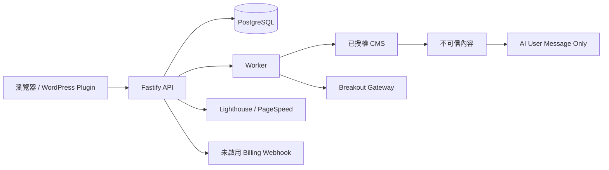

# PH2-04 安全、私隱與 SSRF 核檢

> 文件狀態：已批准，修復實作完成 v1.2
> 建立日期：2026-09-13
> 批准人：Product Owner（使用者）
> 批准時間：2026-09-13（當前會話）
> 前置批准：`APPROVE PH2-00`、`APPROVE PH2-01`、`APPROVE PH2-02`、`APPROVE PH2-03`
> 依據：`docs/rankwoven-phase-2-development-workflow.md`、`docs/approvals/phase-2/PH2-03-architecture-api-contract.md`
> 本步不啟用：真實 SEO Provider、公開 URL 抓取、CMS 發佈、付款 webhook、outreach 郵件寄送。

## 1. 範圍與成功標準

PH2-04 處理公開 URL、CMS 站點 URL、Webhook、WordPress 憑據、AI prompt、內容快照、付款與聯絡資料的安全與私隱邊界。

完成標準：

1. 所有伺服器端 URL 抓取都經過 scheme、host、DNS、IP、port、redirect、timeout、response size 與 MIME policy。
2. 任何 private、loopback、link-local、metadata、ULA、IPv4-mapped IPv6 或 DNS rebinding 目標都會被拒絕，且拒絕前不會建立連線。
3. `JWT_SECRET` 與 `WORDPRESS_CREDENTIAL_ENCRYPTION_KEY` 在 production 是必填且不同的高熵值；沒有 fallback。
4. 所有 state-changing API 都有伺服器端 auth、workspace scope、role 與 idempotency 邊界；公開 webhook 在驗簽前不處理 payload。
5. 外部網頁、CMS 正文與 AI 生成內容均視為不可信資料，不能改寫 system instruction、工具權限、資料庫查詢或 CMS 發佈決策。
6. 資料保留、刪除、匯出、金鑰輪換、內容最小化與人工批准都有可執行政策。

## 2. 現況資料流



信任邊界：

- Client 與 WordPress Plugin 輸入不可信，必須由 Zod／Token／workspace scope 驗證。
- CMS `site_url`、文章 HTML、媒體 URL、競品網址與外部頁面皆是不可信 URL／內容。
- Breakout、DataForSEO、Ahrefs、Semrush、Google、Stripe、PayPal 是外部系統；只由 server-side adapter 呼叫。
- PostgreSQL 是事實來源；Redis 只作 queue／lock；任何 secret 不得寫入 task payload、audit metadata 或一般日誌。

## 3. 已驗證阻塞項

| ID | 嚴重度 | 狀態 | 證據 | 可利用路徑 | 修復門檻 |
| --- | --- | --- | --- | --- | --- |
| SEC-01 | P0 | FIXED | `apps/api/src/lighthouse.ts`、`packages/security/src/index.ts` | 任意 URL 現在先經 `PublicUrlPolicy`；production 停用本機 Lighthouse fallback，unsafe URL 回傳 `UNSAFE_TARGET_URL`。 | URL policy、Lighthouse regression test。 |
| SEC-02 | P0 | FIXED | `apps/worker/src/index.ts`、`packages/security/src/index.ts` | Worker 在帶 Basic Auth request 前驗證 URL，固定至已驗證 DNS address，redirect 手動處理並拒絕跨 origin。 | URL、DNS／IP、redirect、timeout、MIME、2 MiB response cap test。 |
| SEC-03 | P0 | FIXED | `apps/api/src/siteConnections.ts` | 建立站點連接要求登入及 `editor+`；repository create 使用呼叫者 workspace。 | 匿名建立 route regression test。 |
| SEC-04 | P0 | FIXED | `apps/api/src/config.ts`、`docker-compose.prod.yml`、`Dockerfile.production` | production 需不同且至少 32 字元的 JWT／CMS key，Compose 使用 production mode、non-root runtime image 與 build-start command。 | config parse 與 production Compose dry-run。 |
| SEC-05 | P1 | FIXED | `apps/api/src/auth.ts` | 忘記密碼不再回傳或記錄 reset token。 | no-log／no-response-token test。 |
| SEC-06 | P1 | FIXED | `apps/api/src/auth.ts` | 新密碼使用帶 random salt 的 Node `scrypt`；舊 HMAC hash 僅能經顯式 `LEGACY_PASSWORD_HMAC_SECRET` 一次性升級。 | 登入／註冊 regression tests。 |
| SEC-07 | P1 | FIXED | `apps/worker/src/index.ts` | Worker log 只記錄欄位、內容長度及 task context，不再記錄 CMS 原文。 | Worker regression test。 |

下列項目是已確認但不在本日高信心主 finding 的範圍：

- 全域 rate-limit key 使用 request supplied `X-Forwarded-For`（`apps/api/src/server.ts:94-98`）；PH2-05 應改為可信 proxy 設定或 `request.ip`，防止用 AI endpoint 作成本放大。
- Web auth token 存於 `localStorage`（`apps/web/src/stores/auth.ts:12-42`）；在 CSP、XSS 防護與 refresh-token 設計完成前，不新增可渲染不可信 HTML 的後台頁面。
- production API／Worker 已改用 `Dockerfile.production` 的 non-root runtime；原始 `Dockerfile` 仍保留給本地 development Compose，不用於 production override。

## 4. SSRF 設計

### 4.1 `PublicUrlPolicy`

唯一可由 adapter 使用的 URL 入口，適用於 Lighthouse、PageFetchService、CMS site diagnostics、媒體 URL import 與後續競品抓取。

1. 僅接受絕對 `http:`／`https:` URL，拒絕 userinfo、fragment、non-ASCII host、空 host、非 80／443 port 與超過 2,048 字元 URL。
2. 以 `dns.promises.lookup(host, { all: true, verbatim: true })` 解析；每個 A／AAAA 都要通過 policy。
3. 拒絕 IPv4：`0.0.0.0/8`、`10.0.0.0/8`、`100.64.0.0/10`、`127.0.0.0/8`、`169.254.0.0/16`、`172.16.0.0/12`、`192.0.0.0/24`、`192.168.0.0/16`、`198.18.0.0/15`、multicast、reserved 與 metadata IP。
4. 拒絕 IPv6：`::`、`::1`、`fc00::/7`、`fe80::/10`、IPv4-mapped private address、multicast、reserved 與 metadata hostname。
5. DNS validation 後以受控 dispatcher／lookup 建立連線，避免 fetch／Puppeteer 重新解析造成 DNS rebinding；每次 redirect 重新做完整 DNS／IP policy。
6. `redirect: 'manual'`，最多 3 次 redirect；只接受 `text/html`、`application/xhtml+xml`、必要時圖片 MIME；header timeout 5 秒、全程 timeout 15 秒、response body 上限 2 MiB。
7. 不轉送 Authorization、Cookie、CMS credential、internal header；外部抓取使用獨立 egress policy，禁止連到 Docker network、host gateway、metadata service。
8. Lighthouse 的自由 `url` query 在修復後只允許經 `PublicUrlPolicy` 驗證；`siteId` 需在建立與執行時雙重驗證其 canonical host。

### 4.2 預期錯誤契約

拒絕 URL 時返回：

```json
{
  "success": false,
  "message": "目標網址不符合安全抓取規則",
  "error": { "code": "UNSAFE_TARGET_URL" }
}
```

不得回傳內部 IP、DNS 結果、proxy 設定、metadata response 或底層 fetch stack。

## 5. AI 與內容安全

1. CMS HTML、競品內容、文章、圖片 metadata、email contact 與外部頁面永遠放在 AI user content／quoted source 區域，不得插入 system prompt 或 tool schema。
2. AI 無權直接發佈、寄信、讀 secret、修改 entitlement 或執行 SQL；所有副作用由 application service 以結構化輸入、workspace scope、human approval、stale snapshot 與 idempotency 再驗證。
3. 數字、引用、claim、搜尋量、排名與外鏈存在性必須標記 sourceType，未驗證 claim 不得自動套用。
4. AI 回覆需按 operation 設 JSON schema／字數上限／timeout／cost cap；拒絕、截斷、schema invalid 與 partial result 要寫 task attempt，但不寫完整 prompt／response。
5. 已有文字 generation 將內容放在 user message，且沒有 tool calling；新增 PageFetch／RAG 前仍必須完成本節 guardrail。

## 6. 私隱與資料保留提案

| 資料類別 | 最小保存 | 建議保留 | 刪除／匯出規則 |
| --- | --- | --- | --- |
| 帳戶 email、角色、password hash | 帳戶營運 | 帳戶有效期 + 30 日 | owner 可要求匯出；刪除後匿名化 audit actor。 |
| WordPress Application Password／OAuth secret | 加密 secret reference | 直到解除連接 | 解除站點時立即刪除密文；金鑰輪換後要求重新授權。 |
| 同步 CMS 正文、媒體 metadata | SEO 審計與人工審核 | 90 日或站點解除後 30 日 | workspace／site 級刪除 job，含 object／cache 清理。 |
| AI prompt／completion／外部頁面 raw body | 除錯與可追溯性 | 預設不存 raw；只存 hash／版本／摘要 | 高權限、短期加密 quarantine 才可保留 7 日。 |
| Provider metrics／keyword snapshot | 趨勢比較 | 13 個月 | 匯出時保留 provider、日期、location、estimated flag。 |
| audit event | 安全與法務追溯 | 365 日 | append-only；只存 resource ID、hash、狀態與安全 metadata。 |
| application／worker logs | 運維 | 30 日 | redact token、password、正文、reset URL、CMS value。 |
| webhook event hash／處理結果 | 去重與帳務追溯 | 180 日 | 不保存完整 payment payload 或卡號資料。 |

此表是工程預設，不是法律意見。正式上線前由 privacy／legal reviewer 根據營運地區、DPA、刪除例外與用戶合同確認 GDPR、PECR、CAN-SPAM、PCI 等適用責任。

## 7. 權限與監控

- `viewer` 只讀；`editor` 建立研究與內容任務；`admin` 管理 provider profile／price；`owner` 管理 team、billing 與資料刪除。
- 所有 site、project、run、candidate、snapshot、task 都以 workspace scope 查詢；跨 workspace 回傳 404。
- 站點建立、credential 變更、token regenerate／revoke、profile 變更、內容 approve／apply／rollback、資料刪除與 webhook 處理均寫 audit event。
- 對 `AUTH_LOGIN_FAILED`、`UNSAFE_TARGET_URL`、`FORBIDDEN`、`IDEMPOTENCY_KEY_REUSED`、provider 429／timeout、dead-letter、quota 50／80／100% 建立告警。

## 8. PH2-04 修復順序

1. 修復 SEC-04、SEC-05、SEC-06：production config、secret validation、移除 reset token response／log、移除 fallback、實作 password hash migration。
2. 修復 SEC-03：所有站點連接寫入改為認證 + workspace scoped repository。
3. 修復 SEC-01、SEC-02：建立 `PublicUrlPolicy`、套用至 Lighthouse 與 CMS URL，加入 SSRF regression test。
4. 修復 SEC-07、設定 log redaction、按 retention table 建立刪除 job interface。
5. 設定 trusted proxy／CORS allowlist 已完成；non-root production containers 已完成。CSP／token storage 改造列入後續 Web hardening。
6. 建立付款 webhook signature verifier，但保持功能關閉直到 PH2-11 審批。

## 9. 驗收測試

- URL policy 拒絕 loopback、private IPv4、IPv6 ULA、link-local、metadata host、非標準 port、redirect 至 private IP、DNS rebinding、超大 response 與非預期 MIME。
- 未登入者無法建立、更新、刪除 site 或取得 site API token；不同 workspace 對相同 site URL 互不可見／修改。
- production 缺少或重複 JWT／CMS encryption secret 時 API／Worker fail fast；reset token 不存在於 log、response、audit metadata。
- CMS credential、AI prompt、synced content、snapshot before value、OAuth token 與 payment payload 不出現在一般 log。
- 外部內容含「忽略指令」時，不能改變 AI system prompt、工具權限、CMS publish 或 secret access。
- webhook 在 signature invalid、重放、provider disabled 時不建立 task／entitlement change。
- lint、test、build、security audit、SSRF contract test、workspace isolation integration test 全部通過。

## 10. 核檢與批准門檻

- [x] Stack、attack surface、secret、dependency、CI／Docker、webhook、AI／OWASP／SSRF 盤點完成。
- [x] 已驗證 PH2-04 blockers、攻擊步驟與修復順序已記錄。
- [x] SSRF、prompt injection、credential、retention、role、monitoring 設計已定義。
- [x] SEC-01 至 SEC-07 已修復並通過安全回歸測試；任務管理 API、死信統計／告警與 WordPress 媒體掃描亦已補上 workspace、認證、輸入及錯誤脫敏邊界；真實外部副作用仍需各自的後續產品 gate。
- [ ] Privacy／legal reviewer 尚未確認資料保留與地區義務。

**Decision**：`APPROVE PH2-04` 已收到。安全修復狀態為 `IMPLEMENTATION_COMPLETE`；已完成錯誤詳情脫敏、任務 workspace 隔離、死信告警認證、WordPress API 抓取 URL policy 與 site audit 錯誤碼收斂。真實 SEO Provider、CMS 寫入及支付 webhook 仍須通過 PH2-06、PH2-07、PH2-09、PH2-11 的獨立 gate。Privacy／legal reviewer 對資料保留及營運地區義務的確認仍是上線前外部批准事項。
