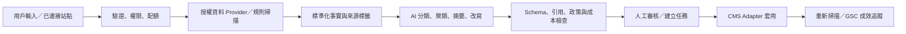

# RankWoven 第二階段 AI SEO Intelligence PRD

> 文件狀態：Draft v1.1（PH2-01 已批准；PH2-02 待批准）
> 建立日期：2026-09-12
> 產品基線：`main@a991d75`
> 適用團隊：產品、設計、前端、API、Worker、資料、增長與客戶成功
> 相關文件：`docs/seo-ai-platform-prd.md`、`docs/frontend-page-spec.md`、`docs/rankwoven-phase-2-development-workflow.md`、`docs/research/phase-2-ai-seo-2026.md`、`docs/research/phase-2-api-pricing-2026.md`
> Provider／成本核檢：`docs/approvals/phase-2/PH2-02-provider-selection.md`

## 1. 執行摘要

RankWoven 第一階段已建立 WordPress 連接、內容同步、SEO 規則審計、Site Audit、Lighthouse、GSC、GA4、AI 優化建議、內部連結、任務、快照回滾及基礎關鍵詞建議。第二階段不應重做這些入口，而應把零散工具升級為可保存、可追溯、可監控、可計費的 SEO Intelligence 工作流。

第二階段的核心產品承諾是：

> 用戶從一個關鍵詞、網站或文章開始，在同一工作台取得有來源的市場資料、可解釋的優先級、可審核的內容修改及可追蹤的成效；RankWoven 不捏造搜尋量、競品流量、權威分數、作者經驗或引用資料。

建議分四段交付：

| 階段     |          建議週期 | 核心結果                                            | 上線形態      |
| -------- | ----------------: | --------------------------------------------------- | ------------- |
| Phase 2A |              6 週 | Keyword Intelligence + Content Optimizer + 用量帳本 | 邀請制 Beta   |
| Phase 2B |              4 週 | Site Audit 修復中心 + 競品／AI 可見度監控 + Stripe  | 公開付費 Beta |
| Phase 2C | 6–10 週，另行估算 | 外鏈機會、Shopify、公共 API、PayPal、企業治理       | 分批 GA       |
| Phase 2D |  5–7 週，獨立排期 | Joomla／OpenCart 第一版承接                         | CMS 擴展 GA   |

使用者提出的全部功能無法在 2–3 週內可靠完成。2–3 週只適合驗證一個垂直切片，例如「輸入種子詞與競品域名 → 取得有來源的 gap 關鍵詞 → 保存為內容 brief」。

## 2. 現況基線

### 2.1 已有能力

- 關鍵詞入口 `/app/keywords`，可由 AI 或模板產生建議。
- DataForSEO、Ahrefs、Semrush 指標 Provider 及 GSC 實際表現資料接入點。
- 關鍵詞資料已區分已驗證來源與估算來源，但結果目前不持久化為研究專案。
- Site Audit 已有排程、結果、問題分類與 SerpApi 配額記錄。
- Lighthouse 已有 PageSpeed Insights 與本地 Chromium 回退；第二階段需把 field data 長期來源改為直接 CrUX API。
- 文章、頁面、商品已有規則式 SEO 評分；內容、標題、描述、媒體及內鏈建議可進入審批流程。
- WordPress 連接、同步、Token、建議套用、任務重試與快照回滾已有基礎。
- GSC、GA4、前後台 i18n、亮／暗主題與生產部署流程已存在。

### 2.2 主要缺口

- 關鍵詞建議是一次性請求，缺少研究專案、歷史快照、標籤、聚類、競品 gap 與內容計劃。
- 目前 AI 關鍵詞通常只生成少量候選，未形成語義、問題詞、實體詞、修飾詞與搜尋意圖的多路擴展。
- 沒有競品 ranked keywords、估算自然搜尋流量、頁面重疊、SERP feature 或 backlink gap 的正式資料模型。
- 沒有獨立內容優化工作台、逐項證據、claim ledger、引用驗證及段落級改寫流程。
- Site Audit 能發現問題，但未完整串接「問題 → 修復方案 → 任務 → 驗證 → 關閉」。
- 沒有持久化競品監控、AI 搜尋引用監控、告警去重與通知偏好。
- 定價頁存在，但訂閱、Entitlement、用量帳本與超額規則尚未形成完整閉環。
- 語言選單列出 11 種語言，但目前完整訊息目錄以 `en` 與 `zh-Hant` 為主；不能把 fallback 英文視為已完成本地化。
- WordPress 是主要可用 CMS；Shopify、公共 API 與完整反向內容推送仍未達第二階段要求。

### 2.3 PH2-00 現況核檢結論

完整證據記錄在 `docs/approvals/phase-2/PH2-00-current-state.md`。本次核檢確認：

- 公開前台目前由 10 個固定公開入口、`/blog` 及 86 篇 Blog 文章組成；最近一次 build 生成 96 個公開 SEO fallback，並驗證公開頁與文章內鏈無孤島。
- 目前 Vue Router 仍使用 flat `/app/*` 與 5 個 `/admin/*` route；第二階段的 `/app/sites/:siteId/*`、`/tools/*`、`/app/billing`、`/app/visibility`、`/admin/providers` 等 canonical route 尚未落地。
- 第一階段部分原標為「未完成」的後端能力已存在：批量 approve／apply、死信重試／忽略／export、WordPress 寫回前最新值讀取、註冊／改密碼／忘記密碼／重設密碼 API 均有本地測試證據。缺口轉為統一 UI／持久化計劃、外部 E2E、email verify、OAuth、多工作區、報告、計費與跨 CMS。
- `npm run lint`、`npm run test`、`npm run build`、`npm run security:audit` 及生產 `/health`／主站 `200 OK` 均通過；這些結果只證明現有基線健康，不代表第二階段新 route／API 已完成。
- 工作區存在使用者既有未提交修改；第二階段實作必須只 stage 當前批准步驟的文件／程式碼，禁止以 `git add .` 夾帶。

PH2-00 的整合結果以第 9.7 第一版承接清單、第 11.3–11.5 路由與 SEO 契約、第 13.4 承接 API 及第 20 節分階段排期為準；若與第一階段 2026-07-28 百分比審計不同，以本次有證據的判定為準。

### 2.3 PH2-00 現況核檢結論

完整證據記錄在 `docs/approvals/phase-2/PH2-00-current-state.md`。本次核檢確認：

- 公開前台目前由 10 個固定公開入口、`/blog` 及 86 篇 Blog 文章組成；最近一次 build 生成 96 個公開 SEO fallback，並驗證 86 篇文章內鏈與 10 個公開入口內鏈無孤島。
- 目前 Vue Router 仍使用 flat `/app/*` 與 5 個 `/admin/*` route；第二階段的 `/app/sites/:siteId/*`、`/tools/*`、`/app/billing`、`/app/visibility`、`/admin/providers` 等新 canonical route 尚未落地，需由 PH2-01／PH2-08 實作。
- 第一階段部分原標為「未完成」的後端能力其實已存在：批量 approve／apply、死信重試／忽略／export、WordPress 寫回前最新值讀取、註冊／改密碼／忘記密碼／重設密碼 API 均已可在本地測試看到。缺口轉為統一 UI／持久化計劃、外部 E2E、email verify、OAuth、多工作區、報告、計費與跨 CMS。
- `npm run lint`、`npm run test`、`npm run build`、`npm run security:audit` 及生產 `/health`／主站 `200 OK` 均通過；這些結果只證明現有基線健康，不代表第二階段新 route／API 已完成。
- 工作區存在使用者既有未提交修改；第二階段實作必須只 stage 當前批准步驟的文件／程式碼，禁止以 `git add .` 夾帶。

PH2-00 的整合結果以第 9.7 第一版承接清單、第 11.3–11.5 路由與 SEO 契約、第 13.4 承接 API 及第 20 節分階段排期為準；若與第一階段 2026-07-28 百分比審計不同，以本次有證據的判定為準。

## 3. 關鍵產品取捨

| 初步想法                                                  | 第二階段決策                                                                                                     | 原因                                                        |
| --------------------------------------------------------- | ---------------------------------------------------------------------------------------------------------------- | ----------------------------------------------------------- |
| AI 反推競品 Top 100 關鍵詞與流量                          | Top 100 排名與流量估算必須來自授權 SEO 資料 API                                                                  | 模型不能觀測真實排名或流量                                  |
| 顯示競品「流量來源」                                      | 只顯示 Provider 提供的估算自然／付費搜尋可見度；Direct、Email、Social 不作推測                                   | 任意競品的完整渠道資料不可由公開頁可靠取得                  |
| 顯示統一「SEO 權重」                                      | 顯示 Provider 原生名稱與來源，例如 DR、Authority Score 或 Domain Rank；不跨 Provider 偽裝成同一真值              | 各供應商方法不同，不可直接等同                              |
| AI 自動加入數據、案例與引用                               | 只可加入可驗證來源；沒有來源時輸出「需要作者補充」欄位                                                           | 防止虛構事實、案例與 E-E-A-T 信號                           |
| AI 自動提升 E-E-A-T                                       | AI 可改善結構與呈現，真實經驗、作者身份、資格及第一手證據必須由用戶提供                                          | E-E-A-T 不是可由文字模型憑空製造的分數                      |
| 為 Google AI 搜尋加入特殊 markup／`llms.txt` 即可提升排名 | 保留 `llms.txt` 作其他生態系輔助，但 Google GEO 評分只採可抓取、可索引、原創證據、作者信號與頁面體驗等可解釋檢查 | Google 官方不要求 `llms.txt`、特殊 AI markup 或刻意內容切塊 |
| 付費版無限使用                                            | 採套餐 Entitlement + Research Credits，用量透明並設硬上限／超額規則                                              | AI、SERP、backlink 與爬取成本會隨使用量增加                 |
| 自動建立外鏈／自動寄信                                    | 先做機會推薦與個人化草稿，不自動發送                                                                             | 降低垃圾郵件、連結操縱、品牌與合規風險                      |
| 多個模型自由代理所有流程                                  | 使用有界工作流、結構化輸出、允許清單工具與人工審批                                                               | 可測試、可控制成本，降低 prompt injection 風險              |
| 立即同時接 Ahrefs、Semrush、DataForSEO                    | Phase 2A 選一個主資料 Provider；其他先保留 BYOK Adapter                                                          | 防止指標混用、成本失控與整合週期膨脹                        |

## 4. 問題陳述

現有 SEO 工具常把「資料查詢、AI 建議、內容改寫、技術審計、監控」拆成互不相連的頁面。用戶需要自行判斷哪些數字可信、哪些建議值得做、做完後是否有效。小型站長缺乏時間，代理商缺乏跨客戶追蹤與成本控制，內容團隊則擔心 AI 虛構與批量低價值內容。

RankWoven 第二階段要解決三個問題：

1. 把種子詞與競品資料轉成有證據、有優先級的內容機會。
2. 把文章診斷轉成可審核、可回滾、可驗證的修改，而非只有一個模糊分數。
3. 把一次性報告轉成持續監控、任務與成效閉環，同時控制資料與模型成本。

## 5. 目標與非目標

### 5.1 產品目標

- 讓首次使用者在 10 分鐘內完成第一個關鍵詞研究或站點體檢並看見可執行結果。
- 每個搜尋量、排名、CPC、競爭度、估算流量與權威指標均顯示來源、地區、語言與更新時間。
- 用戶可把關鍵詞機會一鍵轉成內容 brief，再分析或改寫既有文章。
- 每個 AI 建議都能追溯 prompt 版本、模型、輸入版本、來源與人工決策。
- 技術問題可建立修復任務，完成後重新掃描並自動比對是否關閉。
- 以用量帳本限制可變成本，公開付費 Beta 的單一工作區毛利目標不低於 70%。

### 5.2 非目標

- 不承諾 Google 排名、流量或 AI 引用結果。
- 不繞過搜尋引擎規則抓取 Google 搜尋結果；排名資料只走授權 Provider。
- 不把 AI 估算值包裝成已觀測數據。
- 不自動發佈整篇 AI 內容；仍需預覽、批准與快照。
- 不自動購買、交換、建立或注入外鏈。
- 不在 Phase 2A 同時完成 WordPress、Shopify、Joomla、OpenCart 的等量功能。
- 不在首批版本建立任意工具調用的自主 SEO Agent。
- 不在沒有來源時自動生成統計數字、客戶案例、作者資歷或引言。

## 6. 目標使用者與 JTBD

### 6.1 獨立站長／內容創作者

需要快速找到值得寫的長尾詞、理解現有文章缺口，並在不學習多套工具的情況下完成安全修改。

### 6.2 SEO 顧問／代理商

需要在多個客戶站點上保存研究、比較競品、批量建立任務、追蹤變化並控制每個工作區用量。

### 6.3 內容營運／編輯

需要清楚知道修改原因、來源與風險，逐段審閱內容，不接受只有總分或整篇黑箱重寫。

### 6.4 企業與整合開發者

需要 API、權限、審計紀錄、用量上限、資料保留政策及可預測的供應商行為。

## 7. 使用者故事

1. 作為站長，我希望輸入一個種子詞、目標市場和語言，取得語義相關、問題式及長尾詞，從而找到更具體的內容機會。
2. 作為站長，我希望每個指標標明實際來源或 AI 推論，從而不會把估算當成真實數據。
3. 作為 SEO 顧問，我希望加入自有站與最多五個競品域名，查看我未覆蓋而競品已有排名的關鍵詞。
4. 作為 SEO 顧問，我希望將 gap 結果按搜尋意圖、主題、地區、裝置、難度及商業價值篩選。
5. 作為內容策略人員，我希望保存候選詞、加入標籤、指定負責人並轉成內容 brief。
6. 作為 GSC 已連接用戶，我希望機會分數考慮現有曝光、點擊與平均位置，優先處理接近突破的內容。
7. 作為內容編輯，我希望貼上內容、輸入 URL 或選擇已同步文章後看見逐項分數、證據與修復建議。
8. 作為內容編輯，我希望分別改寫標題、摘要、大綱、單一段落或全文，而不是被迫接受整篇替換。
9. 作為內容編輯，我希望所有新統計或事實都有可開啟來源，沒有來源的內容保留為待補欄位。
10. 作為作者，我希望補充第一手經驗、作者資格、案例及品牌語氣，再由 AI 協助組織，而不是由 AI 虛構。
11. 作為多語言用戶，我希望介面語言、內容語言、目標市場與方言可分開設定。
12. 作為美國市場編輯，我希望選擇 `en-US`；作為英國市場編輯，我希望選擇 `en-GB` 並套用相應拼字、單位和語氣。
13. 作為站長，我希望輸入網址後看見 robots、sitemap、狀態碼、canonical、hreflang、結構化資料、死鏈與 Core Web Vitals 問題。
14. 作為工程人員，我希望每個技術問題附受影響 URL、偵測證據、預期結果與框架相關修復片段。
15. 作為站長，我希望把審計問題變成任務並在修復後重新掃描，以確認問題真的消失。
16. 作為代理商，我希望按日或按週監控競品排名、內容更新、backlink 與 AI 引用變化。
17. 作為代理商，我希望只收到超過閾值的新出現、明顯上升、明顯下降或遺失告警，避免通知噪音。
18. 作為品牌團隊，我希望追蹤固定問題集中哪些 AI 搜尋回答提及或引用我和競品，並看見採樣時間與波動說明。
19. 作為外鏈人員，我希望取得主題相關、可解釋的合作機會與聯絡草稿，而不是低品質網址清單。
20. 作為合規負責人，我希望 outreach 草稿不會被系統自動寄出，並能維護拒收與不可聯絡名單。
21. 作為內容編輯，我希望批准後把合作文章草稿發布到我已授權的 WordPress、Ghost 或 Shopify，而不是手動重複貼上內容。
22. 作為站點 Owner，我希望發布前看到目標 CMS、連結 URL、錨文本、`rel` 屬性、快照及預估用量，從而能確認每一項變更。
23. 作為 SEO 顧問，我希望發布後重新抓取目標頁並記錄連結是否存在、是否可索引及是否被 `nofollow`／`sponsored` 限定。
24. 作為 WordPress 用戶，我希望新內容發布或更新後自動觸發同步與重新評估，但所有寫回仍受權限及審批控制。
25. 作為 Shopify 商戶，我希望只授權必要 scope，同步商品、集合、頁面與 Blog SEO 欄位，不讓工具修改價格、庫存或訂單。
26. 作為付費用戶，我希望在執行前看見預計消耗、執行後看見實際用量及剩餘額度。
27. 作為工作區 Owner，我希望管理套餐、付款方式、成員 Entitlement、API Key 與超額策略。
28. 作為 API 使用者，我希望每個非同步任務都有 idempotency key、狀態、錯誤碼、重試資訊與 webhook。

## 8. 產品原則

1. **Evidence first**：先建立可驗證事實，再讓 AI 解釋與排序。
2. **Answer first**：每個問題先顯示直接結論，再展開證據與技術細節。
3. **Human in control**：內容與 CMS 寫回預設需人工批准；批量操作可預覽、可取消、可回滾。
4. **No silent fallback**：Provider 失敗時清楚標示 partial 或 unavailable，不以模型猜測填補真實指標。
5. **Actionable by design**：每個發現至少能保存、忽略、建立任務或產生修復建議。
6. **Cost visible**：高成本任務先顯示預估，所有消耗落入 append-only usage ledger。
7. **Locale is context**：語言、國家／地區、搜尋引擎、裝置與方言是研究輸入，不只是翻譯設定。

## 9. 功能範圍與優先級

### 9.1 P0：Keyword Intelligence

#### 9.1.1 研究專案

輸入：

- 專案名稱。
- 種子詞 1–20 個。
- 自有域名 0–1 個。
- 競品域名 0–5 個。
- 國家／地區、語言、搜尋引擎、桌面／行動裝置。
- 可選的產品、受眾及轉換目標。

輸出：

- 語義相關詞、長尾詞、問題詞、修飾詞、實體詞及 SERP feature 機會。
- 搜尋意圖：informational、commercial investigation、transactional、navigational、local。
- 主題聚類、父主題、建議頁面類型及 cannibalization 提示。
- 自有站已有排名、競品排名、內容 gap、重疊率與可保存機會。
- 每個欄位的來源、採集時間、地區、語言、裝置與新鮮度。

#### 9.1.2 競品資料定義

- 「Top 100 關鍵詞」代表指定市場與 Provider 資料庫中，競品位於自然搜尋前 100 名的關鍵詞；不是競品內部 Analytics 全量資料。
- 「估算自然搜尋流量」必須顯示 `provider_estimated`，不可稱為實際訪問量。
- 競品 Direct、Referral、Email、Social 流量不在本功能推測；若日後採購合規 clickstream 產品，須另立資料授權與準確度說明。
- 權威指標必須顯示 Provider 原生名稱及量尺，不產生無來源的通用「SEO 權重」。

#### 9.1.3 Opportunity Score v1

總分 0–100，由以下可解釋維度組成：

| 維度                | 權重 | 來源                                    |
| ------------------- | ---: | --------------------------------------- |
| Demand              |   30 | 搜尋量、趨勢、GSC 曝光                  |
| Attainability       |   25 | Keyword Difficulty、當前排名、SERP 競爭 |
| Business fit        |   20 | 用戶設定的產品／轉換目標與人工優先級    |
| Existing traction   |   15 | 自有站 GSC 點擊、曝光、CTR、位置        |
| Freshness／momentum |   10 | 搜尋趨勢與競品新／失排名變化            |

規則：

- 缺少維度時，總分必須同時顯示 `confidence`，不能以中位數靜默填充。
- 不同 Provider 的難度或權威指標不可直接混在同一研究結果；切換 Provider 時重新計算並標示版本。
- v1 權重可由管理端版本化，不開放每個用戶自由調整，避免產品變成不可比較的配置面板。

#### 9.1.4 驗收標準

- 研究任務可保存並在重新登入後繼續查看。
- 同一研究可重跑，新結果形成快照，不覆蓋舊數據。
- 競品 gap 至少支持 Missing、Weak、Strong、Shared 四種視圖。
- 所有數值型 SEO 指標有 `sourceType`、`provider`、`collectedAt`、`location`、`language`。
- Provider 無數據時顯示「無可用資料」，不可顯示 AI 估算搜尋量。
- 用戶可選擇候選詞並建立內容 brief、匯出 CSV 或指派任務。

### 9.2 P0：AI Content Optimizer

#### 9.2.1 輸入與基線

- 支援貼上純文字／HTML、輸入公開 URL、選擇已同步文章。
- URL 內容只讀取公開可抓取正文；移除 script、style、表單、導航噪音與可執行內容。
- 保存輸入雜湊、來源 URL、抓取時間與文章快照，確保分析可重現。
- 用戶選擇 focus keyword、次要關鍵詞、目標市場、內容語言、受眾、漏斗階段及品牌語氣。

#### 9.2.2 評分模型

沿用現有規則式 SEO 檢查，擴展為五個可展開維度：

| 維度               | 權重 | 核心檢查                                                 |
| ------------------ | ---: | -------------------------------------------------------- |
| On-page 結構       |   25 | Title、Meta、H1–H6、Alt、內外鏈、canonical               |
| Query alignment    |   25 | 搜尋意圖、主題覆蓋、主要／次要詞自然出現                 |
| Topical coverage   |   20 | 實體、子題、問題、競品內容 gap；只作建議，不要求機械覆蓋 |
| Readability        |   15 | 句段長度、結構、清晰度、語言相符性                       |
| Trust & citability |   15 | 作者、日期、來源、具體證據、Schema、answer-first 結構    |

每項檢查回傳 `pass`、`warning`、`fail`、`not_applicable`，並包含權重、證據、建議與規則版本。AI 判斷與規則判斷分開顯示。

#### 9.2.3 改寫與 E-E-A-T

- 提供標題、Meta、開場、單段、章節、大綱與全文七種作用範圍。
- 先顯示改前／改後 diff、預期改善項目、可能風險及字數變化。
- 不允許 AI 生成虛構作者經驗、測試結果、專業資格、客戶案例或統計數字。
- 新增 `Claim Ledger`：每個可驗證主張記錄來源 URL、來源標題、擷取時間、支持片段雜湊與狀態。
- 有可信來源時才可插入具體事實；來源不足時輸出 `SOURCE_REQUIRED`，並向用戶顯示「需要作者補充第一手證據」或「需要可靠來源」。
- 用戶提供的第一手經驗標記為 `user_asserted`，由用戶負責確認，不冒充第三方驗證。
- 套用到 CMS 前必須再次讀取最新內容；若雜湊不同則阻止覆蓋並要求重新比較。

#### 9.2.4 多語言本地化

- `uiLocale`、`contentLocale`、`targetMarket`、`dialect` 分開保存。
- Phase 2A 內容優化正式支持 `en-US`、`en-GB`、`zh-Hant-HK`、`zh-Hans-CN`、`es-ES`、`es-MX`。
- 翻譯不是逐字直譯；需要處理拼字、單位、貨幣、地區例子、搜尋意圖與關鍵詞資料庫。
- 未經人工或語言 QA 的介面語言不得標示為「完整支持」。現有其他語言可以保留 Preview 標籤或暫時隱藏。
- 發佈內容前提供術語表、不可翻譯品牌詞與 locale QA。

#### 9.2.5 驗收標準

- 相同輸入、相同規則與 prompt 版本能重現同一規則分及可解析輸出格式。
- 任一總分都能展開到所有加分／扣分項，不存在無解釋黑箱分數。
- 結構化輸出 schema 成功率不低於 99.5%；失敗時任務明確標示，不輸出半截內容。
- 測試資料集中虛構數字或不存在引用的漏出率目標為 0；檢測到時阻止套用。
- 用戶可逐項批准、拒絕、編輯、保存草稿及回滾已套用版本。
- 同一文章支持重新分析並顯示分數變化，不把 SEO 分數提升宣稱為排名提升。

### 9.3 P0：前端 AI 站點體檢

#### 9.3.1 入口

- 公開入口 `/tools/site-audit`：未登入可掃描首頁及最多 10 個公開 URL，需防濫用。
- 工作台入口 `/app/site-audit`：選擇已連接站點、範圍、裝置及排程，查看完整歷史與任務。
- 保留既有 Site Audit 與 Lighthouse API，擴展 remediation workflow，不另建重複掃描器。

#### 9.3.2 檢查範圍

- HTTP 狀態、redirect chain、死鏈、canonical、robots、noindex、XML sitemap。
- H1／heading、Title、Meta、hreflang、Open Graph、JSON-LD。
- 圖片尺寸、格式、傳輸大小、lazy loading 與 Alt Text。
- 行動端 viewport、互動控制尺寸及 Lighthouse lab data。
- 直接由 CrUX API 取得 28 日滾動 field data 與 Core Web Vitals；不長期依賴 PageSpeed Insights response 內即將停用的 real-world data，沒有 CrUX 樣本時必須顯示「無足夠實際用戶資料」。
- 內容重複、薄內容、孤島頁面、導入／導出內鏈。
- HTTPS、mixed content 與公開安全標頭；不進行侵入式漏洞掃描。

#### 9.3.3 修復中心

每個問題顯示：

- 問題、嚴重度、受影響 URL 數。
- 偵測證據與檢查時間。
- 對搜尋／使用者的實際影響，不使用恐嚇式文案。
- 可執行步驟、平台／框架相關代碼片段及預期驗證方式。
- 「建立任務」「忽略並填寫原因」「重新檢查」操作。
- 可安全自動修復的 WordPress SEO 欄位仍需預覽與批准；伺服器、DNS、模板程式碼只提供建議。

#### 9.3.4 驗收標準

- 掃描任務支援 `queued`、`running`、`partial`、`completed`、`failed`、`cancelled`。
- 單一 URL 失敗不令整個站點結果遺失；顯示成功與失敗數。
- Lighthouse lab data 與 CrUX field data 分區顯示，不能合成一個假精準分數。
- 修復後重跑可將同一 fingerprint 的問題標示為 fixed、persisting 或 regressed。
- 所有 URL 抓取通過 SSRF 防護、redirect 重新驗證、大小與超時限制。

### 9.4 P1：競品與 AI 可見度監控

#### 9.4.1 傳統搜尋監控

- 對保存的競品與關鍵詞按套餐每日或每週採樣。
- 保存排名、估算流量、SERP feature、new／lost／up／down 及來源時間。
- 內容更新只保存 URL、標題、摘要、結構、正文雜湊及變更摘要，不長期複製整篇競品內容。
- 告警以事件 fingerprint 去重，支持閾值、摘要頻率與靜默期。

#### 9.4.2 AI Search Visibility

- 由研究專案產生固定問題集，按模型／搜尋產品、語言、地區及日期採樣。
- 記錄品牌提及、競品共現、被引用 URL、引用域名及 answer share；所有結果標示採樣而非穩定排名。
- 同一問題需保存 prompt 版本與採樣條件，趨勢至少基於多次採樣。
- 可優先採用有授權的 AI visibility／LLM mention Provider；若直接調用具搜尋 grounding 的模型，必須保存返回引用 metadata。
- LLM mentions、AI search volume 與 answer share 一律標示 `provider_estimated` 或 `ai_inferred`；不能與 GSC `first_party_observed` 指標合併成同一數值。
- 不把一次回答中的出現次序稱為「AI 排名」。

#### 9.4.3 驗收標準

- Pro 支援每週監控，Agency 支援每日監控；實際限制由 Entitlement 控制。
- 告警包含基線、當前值、變化量、來源及建議行動。
- 相同資料重送不產生重複告警。
- 用戶可暫停監控、靜默單一事件類型或調整摘要頻率。

### 9.5 P1：外鏈機會與 Outreach 草稿

- 以競品 referring domains、broken links、resource pages、unlinked mentions 與主題相關性產生機會。
- 每個機會顯示來源 Provider、頁面狀態、主題關聯、已知聯絡來源與風險提示。
- 「權威」「垃圾風險」均使用 Provider 原生值，不自行發明精準毒性分數。
- 可根據目標頁、合作理由與收件者背景產生個人化草稿。
- Outreach 層在 Phase 2 只複製／匯出草稿，不直接寄信，不抓取或出售私人 Email；合作文章如需上線，按 9.5.1 只發布到用戶已授權的 CMS。
- 未來寄送功能必須先完成 consent／legitimate interest 流程、地址來源、拒收名單、退信、投訴及地區政策控制。

#### 9.5.1 外鏈發布工作流

外鏈功能按以下六步實作，並在 UI 顯示目前狀態：

| 步驟             | 系統行為                                                                                                  | 產物／限制                                                                    |
| ---------------- | --------------------------------------------------------------------------------------------------------- | ----------------------------------------------------------------------------- |
| 1. 發現機會      | DataForSEO／Ahrefs／Semrush 查詢 referring domains、競品 gap、新／失連結、broken links、unlinked mentions | 保存 Provider、查詢條件、採集日期與估算標籤                                   |
| 2. AI 分析       | AI 評估主題相關性、目標頁匹配、合作理由、潛在風險與建議連結形式                                           | 使用 Structured Output；AI 只作 `ai_inferred`，不創造權威或流量數值           |
| 3. 生成草稿      | 生成 outreach 草稿及／或合作文章草稿                                                                      | 包含目標頁、建議錨文本、來源、`rel` 建議、語言與版本                          |
| 4. 人工批准      | 用戶查看 diff、來源、風險、收件資料來源與預估 credits 後批准                                              | 未批准不可發布、不可寄信；Editor 需具相應權限                                 |
| 5. 授權 CMS 發布 | 只呼叫已連接且狀態為 `connected` 的 WordPress／Ghost／Shopify 等 CMS Adapter                              | 預設發布為 draft；publish／schedule 需 Owner／Admin 或明確授權，先建立快照    |
| 6. 重新抓取驗證  | 發布成功後抓取目標頁，檢查 URL、HTTP、canonical、索引提示、錨文本與 `rel` 屬性                            | 記錄 `verified`、`not_found`、`nofollow`、`sponsored`、`blocked` 或 `changed` |

外鏈機會狀態機：

```text
discovered -> qualified -> drafted -> approved -> publishing -> published
                                                            -> publish_failed
published -> verifying -> verified
                      \-> not_found / changed / blocked
```

工作流規則：

- `source_url` 是機會來源頁；`target_url` 是用戶自有站的落地頁；兩者不可混淆。
- 只有通過 CMS 連接診斷、scope、workspace 權限、內容安全與最新快照校驗，才可進入 `publishing`。
- WordPress、Ghost、Shopify 發布只限用戶已授權的自有／管理站點；RankWoven 不代替第三方站點取得發布權限。
- 合作文章預設草稿；用戶選擇直接發布或排程時，UI 必須二次確認並記錄操作者、時間與 CMS response。
- 付費／贊助內容的外鏈使用 `rel="sponsored"` 或 `rel="nofollow"`；不承諾傳遞排名權重。
- 發布後驗證只報告當時可觀測狀態，不宣稱已獲得排名、索引或 SEO 效果。
- 任何一次失敗、取消或快照不一致都保留草稿及錯誤原因，不自動重試發布。

### 9.6 P2：CMS、公共 API 與商業化擴展

- Shopify 採版本化 Admin GraphQL API、OAuth 最小 scope 及經 HMAC 驗證的 webhook。
- 同步 Products、Collections、Pages、Blog Posts、Files 及 SEO 欄位；不修改價格、庫存、訂單、付款或客戶資料。
- Webhook 先驗證、以 webhook ID 去重、快速回應後入隊；按資源 `updated_at` 防止亂序舊事件覆蓋新狀態，另設每日 reconciliation job 修復漏訊息。
- 公共 API 使用 workspace-scoped API Key、細分 scope、hash 儲存、到期日、最後使用時間、輪替及吊銷。
- Stripe 作為第一個訂閱系統；PayPal 在 Stripe Entitlement 與 webhook 對帳穩定後接入。
- WordPress 新發佈／更新事件觸發增量同步及重新評估，寫回仍受現有批准與回滾規則約束。

### 9.7 第一版未完成項目承接清單

下表把第一版模組覆蓋度審計中的未完成項目納入第二階段，不把已在生產完成的靜態 Web 部署重複排期。每項均需依照對應階段的驗收標準關閉，不能只以頁面存在視為完成。

| 第一版模組                      | 未完成項目                                                     | 第二階段承接              | 完成標準                                                                     |
| ------------------------------- | -------------------------------------------------------------- | ------------------------- | ---------------------------------------------------------------------------- |
| 認證與工作區（60%）             | 註冊、密碼重設、郵箱驗證、多工作區切換                         | 2A P0；OAuth 延至 2B      | Token、邀請、工作區隔離、過期與重設流程均有 API／E2E 測試                    |
| AI 內容優化（80%）              | 批量優化、優化計劃                                             | 2A P0                     | 可建立計劃、逐項排隊、查看 partial 結果、批准後才套用                        |
| AI 文章生成（第一版 M5 未完成） | 關鍵詞 → 標題／大綱／正文草稿／圖片提示詞 → WordPress 草稿     | 2A P1                     | 預設只生成草稿；內容、引用、圖片任務分開記錄，任何發布需人工批准             |
| 審批與應用（80%）               | 批量批准／套用、Apply side-by-side diff、寫回前讀取 WP 真實值  | 2A P0                     | 批量操作可預覽、取消、重試、回滾；內容 hash 不一致會阻止覆蓋                 |
| 關鍵詞研究（60%）               | 精準搜尋量、競爭度、趨勢                                       | 2A P0                     | 由正式 Provider 返回並保存地區、語言、裝置、時間與來源，不用 AI 補數字       |
| 分析儀表盤（70%）               | 多站點比較、報告入口                                           | 2B P1                     | 支援跨站點 GSC／GA4／Audit 對比，明確區分站點與日期範圍                      |
| WordPress 插件（50%）           | 內容推送、文章草稿寫入、插件診斷                               | 2A P0；跨 CMS 2C          | 先建立 WP draft，使用者批准後才可發布；失敗有任務與快照                      |
| Worker 任務隊列（40%）          | 完整重試／退避、死信隊列管理、任務監控面板                     | 2A P0                     | provider-specific retry、dead-letter 重跑／忽略、進度與告警可追溯            |
| 報告與導出（0%）                | PDF／CSV 審計報告、成效對比、白標報告                          | 2B P1                     | 匯出保留來源、時間、地區、裝置、估算標籤；大型報告異步生成                   |
| 定價與訂閱（20%）               | 套餐、用量計費、Stripe／PayPal 支付                            | Stripe 2B；PayPal 2C      | Entitlement、usage ledger、webhook 對帳與 Customer Portal 通過測試           |
| Site Audit                      | 問題詳情展開、實際端到端審計、SerpApi 配額保護、API rate limit | 2A P0                     | URL、證據、修復任務、配額與限流在真實測試站閉環                              |
| 內容品質與 GEO                  | E-E-A-T 證據缺口、過度優化、作者／日期／Schema 檢查            | 2A P0                     | 規則分數與 AI 推論分離；無來源的具體事實不得套用                             |
| 多語言（現有選單 11 種）        | 內容 locale、完整翻譯目錄、方言／市場適配                      | 2A P0；新增語言按 QA 批次 | `en-US`、`en-GB`、`zh-Hant-HK`、`zh-Hans-CN`、`es-ES`、`es-MX` 先完成母語 QA |
| 內部連結                        | 已批准建議的定時自動應用                                       | 2C，預設關閉              | 僅處理批准項目、具每日上限、快照、回滾與 dry-run                             |
| Joomla／OpenCart                | 適配器、內容同步、SEO 建議、套用與回滾                         | 2D                        | 不修改 OpenCart 價格、庫存、訂單、客戶或付款資料                             |

### 9.8 第一版承接的共通要求

- 承接項目沿用現有 `/api/v1` REST 格式、Pinia／i18n、Ant Design Vue 工作台及 BullMQ 任務隊列，不另建平行架構。
- 每個承接功能需有 `feature flag`、權限、用量、錯誤碼、空／Loading／partial／失敗狀態及回滾策略。
- 舊路由在新功能穩定前保留兼容 redirect；不得因新頁面上線而刪除仍被插件使用的 API。
- 第一版待辦若已在生產驗證完成，需在發版記錄中標記為「已完成／不再承接」，避免重複實作。

## 10. 資料真實性與 AI 架構

### 10.1 統一來源類型

所有報告欄位必須使用以下其中一種 `sourceType`：

| 類型                   | 定義                                     | 例子                                    |
| ---------------------- | ---------------------------------------- | --------------------------------------- |
| `first_party_observed` | 站點擁有者授權後取得的第一方觀測值       | GSC 點擊、GA4 sessions、CrUX field data |
| `provider_estimated`   | 第三方 Provider 的模型／clickstream 估算 | 競品估算流量、搜尋量、難度              |
| `deterministic_check`  | RankWoven 規則引擎可重現判斷             | 缺 H1、404、無 Alt、孤島頁面            |
| `ai_inferred`          | AI 對語義、意圖、品質或策略的推論        | 意圖分類、主題聚類、內容角度            |
| `user_asserted`        | 用戶自行提供且尚未外部驗證               | 作者經驗、案例、品牌聲明                |

每筆資料至少包含 `provider`、`providerMetric`、`providerMethodologyVersion`、`collectedAt`、`providerUpdatedAt`、`location`、`language`、`device`、`freshness`、`confidence` 與 `rawResponseRef`。不適用欄位可為空，但不可刪除來源類型；原始 response 只保存加密物件參照，不把憑據或完整 payload 放入工作日誌。

### 10.2 模型路由

PH2-02 的批准候選以 `docs/approvals/phase-2/PH2-02-provider-selection.md` 為準：OpenAI `gpt-5.6-luna` 作互動／embedding 主路由、Gemini 3.8／3.7 Flash Batch 作低成本非同步批量、Claude Sonnet 5 作長文及引用 fallback。模型 ID、價格、生效日期及區域條款必須由 pricing snapshot 提供，業務邏輯不可寫死；未獲 PH2-02 批准前只可使用 fixture，不可在生產啟用新 Provider。

| 任務                    | 預設策略                                    | 原因                               |
| ----------------------- | ------------------------------------------- | ---------------------------------- |
| 意圖分類、標籤、摘要    | 低延遲／低成本模型 + Structured Output      | 高量、低風險、格式固定             |
| 多語言 embedding／聚類  | 多語言 embedding + deterministic clustering | 結果可重跑、避免每次由模型自由分組 |
| Content brief、段落改寫 | 中高品質文字模型                            | 需要語義與文體品質                 |
| Claim 提取與來源對齊    | Structured Output + 引用驗證                | 需要欄位完整及可追溯               |
| 全站批量分析            | 非同步 Batch 或低優先隊列                   | 可降低成本，不阻塞互動             |
| 高風險發佈決策          | 不交給模型自動決定                          | 必須人工批准                       |

要求：

- Provider Adapter 接受統一 Zod／JSON Schema；優先使用供應商原生 Structured Outputs，不再依賴從自由文本截取 JSON。
- 模型輸出通過 schema、商業規則、引用及安全驗證後才可進入產品資料表。
- Structured Outputs 只約束支援 schema 的輸出形狀；應用仍須處理 refusal、截斷、`max_tokens`、不完整輸出及 runtime validation。
- prompt、schema、規則與模型路由全部版本化。
- 同一任務最多一次格式修復；仍失敗則標記 failed，不無限重試。
- Fallback 模型只能處理相同資料權限與保存條款的任務，並在結果中顯示實際 Provider。
- 對不需要供應商保存狀態的敏感 OpenAI 工作流明確使用 `store: false`，由 RankWoven 自行保存版本與審計記錄。
- 不把抓取頁面的文字當成系統指令；外部內容一律是不可信資料。

### 10.3 有界工作流



AI 不直接持有 CMS 寫權限、付款權限或任意 HTTP 工具。套用操作由既有服務依批准記錄及欄位白名單執行。

### 10.4 評測與品質門檻

- 建立 `en`、`zh-Hant`、`zh-Hans`、`es` 的固定評測集，涵蓋資訊、商業、交易、本地意圖。
- Keyword intent／cluster 以人工標註集評估 macro F1；Beta 目標不低於 0.85。
- Structured Output schema 成功率不低於 99.5%。
- 數值來源標籤完整率 100%；模型捏造搜尋量或競品流量的容許率為 0。
- 引用 URL 可開啟率不低於 98%；無來源的具體事實不得通過套用 gate。
- Content Optimizer 建議由雙盲人工評分：正確性、可用性、品牌符合度及語言自然度。
- 任何模型或 prompt 版本變更先跑離線 eval，再以小比例工作區 canary。

## 11. 資訊架構與前端頁面

### 11.1 建議路由（初版保留）

> 本節保留第二階段早期的頁面草案；正式實作以 11.3「Canonical Route Plan」及 11.4「SEO 孤島防護契約」為準。任何新頁面必須先加入 route registry，再加入 Vue Router。

| 路由                            | 用途                           | 階段 |
| ------------------------------- | ------------------------------ | ---- |
| `/app/research`                 | 研究專案列表與新建入口         | 2A   |
| `/app/research/:projectId`      | 關鍵詞、cluster、gap、brief    | 2A   |
| `/app/content-optimizer`        | 內容分析工作台                 | 2A   |
| `/app/content-optimizer/:runId` | 分數、證據、diff、claim ledger | 2A   |
| `/tools/site-audit`             | 公開限額站點體檢               | 2A   |
| `/app/site-audit`               | 已連接站點完整體檢與修復中心   | 2A   |
| `/app/competitors`              | 競品與監控設定                 | 2B   |
| `/app/visibility`               | 傳統搜尋與 AI 引用趨勢         | 2B   |
| `/app/alerts`                   | 告警 inbox 與偏好              | 2B   |
| `/app/billing`                  | 套餐、用量、付款與發票         | 2B   |
| `/app/backlinks`                | 外鏈機會與 outreach 草稿       | 2C   |
| `/app/integrations`             | WordPress、Shopify、GSC、GA4   | 2C   |
| `/app/developers`               | API Key、webhook、文件         | 2C   |

既有 `/app/keywords` 在 2A 期間保留，完成資料遷移後 redirect 至 `/app/research`，不維護兩套關鍵詞邏輯。

### 11.2 互動要求

- 關鍵詞結果以可排序密集表格為主，左側篩選或頂部 filter bar；不要用大量卡片承載逐行資料。
- 來源類型用一致 badge 與 tooltip；估算值不可只用顏色區分。
- Content Optimizer 桌面端使用原文／建議並排 diff，窄螢幕改為切換 Tabs。
- 分數只作導航，首屏同時顯示前三個高影響問題與下一步操作。
- 長任務顯示進度、已消耗 credits、可取消狀態及 partial results。
- 所有頁面提供 Loading、空狀態、partial、quota exceeded、provider unavailable、權限不足及重試狀態。
- 亮／暗主題沿用現有 design token；表格、表單、圖表、badge 需達 WCAG AA。
- 行動端保證檢視、篩選與批准單項操作；批量編輯可引導到桌面，不強塞完整寬表格。

### 11.3 Canonical Route Plan

路由分為公開前台、登入後客戶後台、內部管理後台及認證流程四個邊界。每一條路由由同一份 `route registry` 定義 `path`、`name`、`layout`、`requiresAuth`、`requiresRole`、`indexable`、`canonicalPath`、`sitemapGroup`、`parentRoute`、`titleKey`、`descriptionKey` 和 `keywordKey`；Vue Router、SEO head、靜態 SEO 生成器及 sitemap 均由此資料生成，禁止各自手寫列表。

#### 11.3.1 公開前台路由

公開頁面以可分享、可抓取、可在 HTML 中直接理解為前提。每個 indexable route 必須有唯一主題、唯一主要關鍵詞、完整 H1／正文及至少一個導入入口。

| Canonical route                     | 頁面                         | 索引           | 導入來源／父頁                                         |
| ----------------------------------- | ---------------------------- | -------------- | ------------------------------------------------------ |
| `/`                                 | SEO 教學首頁                 | `index,follow` | root                                                   |
| `/features`                         | 功能總覽                     | `index,follow` | 首頁、公開 footer                                      |
| `/docs`                             | 使用文件與整合指南           | `index,follow` | 首頁、Extension、Help                                  |
| `/help`                             | 常見問題與故障排查           | `index,follow` | 首頁、Docs、footer                                     |
| `/about`                            | 品牌與團隊                   | `index,follow` | 首頁、footer                                           |
| `/contact`                          | 聯絡與技術支援               | `index,follow` | 首頁、Help、footer                                     |
| `/pricing`                          | 套餐與用量                   | `index,follow` | 首頁、工具頁、登入頁 CTA                               |
| `/privacy`                          | 私隱政策                     | `index,follow` | 全站 footer                                            |
| `/terms`                            | 服務條款                     | `index,follow` | 全站 footer、Pricing                                   |
| `/tools`                            | SEO 工具中心                 | `index,follow` | 首頁、Features、Blog                                   |
| `/tools/keyword-research`           | AI 關鍵詞研究                | `index,follow` | Tools、Features、相關 Blog                             |
| `/tools/content-optimizer`          | AI 內容優化                  | `index,follow` | Tools、Features、相關 Blog                             |
| `/tools/site-audit`                 | AI 站點體檢                  | `index,follow` | Tools、首頁、Features                                  |
| `/tools/title-generator`            | SEO 標題工具                 | `index,follow` | Tools、Content Optimizer                               |
| `/tools/meta-description-generator` | Meta Description 工具        | `index,follow` | Tools、Content Optimizer                               |
| `/tools/faq-generator`              | FAQ 生成工具                 | `index,follow` | Tools、Content Optimizer、Blog                         |
| `/tools/content-rewriter`           | 內容改寫工具                 | `index,follow` | Tools、Content Optimizer                               |
| `/tools/competitor-gap`             | 競品關鍵詞 Gap 工具          | `index,follow` | Tools、Keyword Research、Blog                          |
| `/extension`                        | WordPress／Shopify／CMS 整合 | `index,follow` | Features、Docs、首頁                                   |
| `/blog`                             | SEO 教學文章中心             | `index,follow` | 首頁、Tools、footer                                    |
| `/blog/:slug`                       | 單篇 SEO 教學文章            | `index,follow` | Blog 索引、相關文章、上一篇／下一篇                    |
| `/blog/category/:category`          | 文章分類頁                   | 條件式 index   | Blog、文章 breadcrumb；至少 5 篇文章及獨有介紹才可索引 |

公開工具的輸入值、篩選條件、結果排序及登入 redirect 使用 query string，但 query state 不建立獨立 canonical 或 sitemap URL。工具結果若需要保存，轉入登入後 `/app` 工作台，不在公開 URL 生成無限薄頁面。

#### 11.3.2 認證流程路由

| Canonical route          | 用途         | 索引               |
| ------------------------ | ------------ | ------------------ |
| `/login`                 | 登入         | `noindex,nofollow` |
| `/register`              | 註冊         | `noindex,nofollow` |
| `/forgot-password`       | 申請重設密碼 | `noindex,nofollow` |
| `/reset-password/:token` | 設定新密碼   | `noindex,nofollow` |
| `/verify-email/:token`   | 驗證郵箱     | `noindex,nofollow` |

認證頁不進 sitemap；若已登入，導向 `/app`；若未登入訪問受保護路由，保存 `redirect` 參數但在登入後只允許回到同一工作區合法路由。

#### 11.3.3 客戶後台路由

所有 `/app` 頁面均為 workspace-scoped、`noindex,nofollow,noarchive`，不進 sitemap，不輸出公開頁的 structured data。站點功能必須在 URL 或路由 state 中有明確 `siteId`，避免多站點資料混在同一頁。

| Canonical route                         | 頁面                            | 導覽父級          |
| --------------------------------------- | ------------------------------- | ----------------- |
| `/app`                                  | 工作區總覽                      | App shell         |
| `/app/sites`                            | 站點列表與新增連接              | App shell         |
| `/app/sites/:siteId`                    | 單站點總覽                      | Sites             |
| `/app/sites/:siteId/research`           | Keyword Intelligence 與競品 Gap | Site overview     |
| `/app/sites/:siteId/content`            | 文章／頁面／商品內容庫          | Site overview     |
| `/app/sites/:siteId/content/:articleId` | 單篇內容與 SEO 分析             | Content           |
| `/app/sites/:siteId/content/optimizer`  | Content Optimizer               | Content           |
| `/app/sites/:siteId/content/review`     | 建議、Diff、批准與套用          | Content Optimizer |
| `/app/sites/:siteId/media`              | 媒體 SEO                        | Content           |
| `/app/sites/:siteId/links`              | 內部連結與 Backlink 機會        | Content           |
| `/app/sites/:siteId/site-audit`         | 技術 Audit 與修復中心           | Site overview     |
| `/app/sites/:siteId/analytics`          | GSC／GA4／成效比較              | Site overview     |
| `/app/sites/:siteId/tasks`              | 該站點任務、失敗與死信          | Site overview     |
| `/app/sites/:siteId/integrations`       | CMS、GSC、GA4 連接              | Site overview     |
| `/app/research`                         | 跨站研究專案                    | App shell         |
| `/app/monitors`                         | 競品與 AI 可見度監控            | App shell         |
| `/app/alerts`                           | 告警 inbox                      | App shell         |
| `/app/backlinks`                        | 跨站 backlink 機會與草稿        | App shell         |
| `/app/tasks`                            | 跨站任務隊列                    | App shell         |
| `/app/billing`                          | 套餐、用量、付款與發票          | App shell         |
| `/app/integrations`                     | 跨站整合總覽                    | App shell         |
| `/app/developers`                       | API Key、webhook、文件          | App shell         |
| `/app/settings`                         | 個人、工作區、通知及偏好        | App shell         |

客戶後台的每個 route 都需要：App shell 導覽、workspace switcher、site breadcrumb（站點頁）、返回父頁、至少一個下一步 CTA，以及空／Loading／錯誤／無權限狀態。直接輸入深層 URL 也必須能恢復同一導覽上下文。

#### 11.3.4 管理後台路由

所有 `/admin` 頁面均需 `admin` 或更高角色、`noindex,nofollow,noarchive`、不進 sitemap，並與客戶工作區資料隔離。管理後台只能在管理導覽及相鄰管理頁互鏈，不把內部 URL 暴露在公開 HTML。

| Canonical route           | 頁面                       | 必要角色 |
| ------------------------- | -------------------------- | -------- |
| `/admin`                  | 平台總覽                   | `admin`  |
| `/admin/workspaces`       | 工作區與成員               | `admin`  |
| `/admin/customers`        | 客戶與站點                 | `admin`  |
| `/admin/sites`            | 站點連接健康               | `admin`  |
| `/admin/usage`            | Provider／AI／SerpApi 用量 | `admin`  |
| `/admin/providers`        | AI、SEO、支付 Provider     | `admin`  |
| `/admin/tasks`            | 全局任務與死信             | `admin`  |
| `/admin/content-policies` | 內容、GEO、外鏈政策        | `admin`  |
| `/admin/operations`       | 運營、告警與 feature flags | `admin`  |
| `/admin/settings`         | 平台設定與審計             | `owner`  |

#### 11.3.5 舊路由兼容與遷移

舊路由只做 301（公開）或應用內 replace redirect（私有），不再渲染第二份頁面。redirect 必須保留 `siteId`、文章 ID 及必要 query，並在新 canonical 頁完成後移除舊 route 的 sitemap／SEO head。

| 舊路由              | 新 canonical                                             |
| ------------------- | -------------------------------------------------------- |
| `/app/keywords`     | `/app/sites/:siteId/research`；沒有站點時回 `/app/sites` |
| `/app/analytics`    | `/app/sites/:siteId/analytics`                           |
| `/app/lighthouse`   | `/app/sites/:siteId/site-audit?tab=performance`          |
| `/app/site-audit`   | `/app/sites/:siteId/site-audit`                          |
| `/app/media`        | `/app/sites/:siteId/media`                               |
| `/app/apply`        | `/app/sites/:siteId/content/review`                      |
| `/app/links`        | `/app/sites/:siteId/links`                               |
| `/app/tasks`        | `/app/sites/:siteId/tasks`                               |
| `/app/cms-adapters` | `/app/integrations`                                      |

### 11.4 SEO 孤島防護契約

「孤島頁面」定義為可索引 URL 沒有任何其他可索引頁面的導入連結；只存在 sitemap、瀏覽器歷史或 JavaScript 動態請求不算導入連結。防護規則如下：

1. `route registry` 每次 build 產生有向 link graph；所有 `indexable=true` 的 route（Blog 分類除外）必須有至少 1 條不同 canonical route 的導入邊。
2. 公開 hub 頁（首頁、Tools、Blog、Features、Docs、Extension）必須互相連接；每個工具頁至少連回 Tools 及一個相關內容頁；每篇 Blog 至少連回 Blog、同分類文章及前／下一篇（存在時）。
3. Blog 分類只有在文章數、獨有介紹、H1、canonical、breadcrumb 及相關分類互鏈全部達標時才可索引；否則只作 noindex filter state。
4. 公開頁初始 HTML 必須包含可見 H1、可讀正文、breadcrumb／父頁連結、相關頁連結及 footer；不能只在 Vue 掛載後用 JavaScript 生成唯一入口。
5. 所有公開頁須有唯一 title、description、focus keyword、canonical、Open Graph、Twitter Card、JSON-LD；Blog article 另需 BlogPosting、作者、日期及正文內鏈。
6. `sitemap.xml` 只接受 route registry 的 canonical、indexable URL；建議拆為 `sitemap-pages.xml`、`sitemap-tools.xml`、`sitemap-blog.xml` 並由 sitemap index 統一引用。`/rss.xml` 作文章訂閱入口，不把私有頁、query state 或 redirect 放入 sitemap。
7. 多語言頁以 locale route 或明確 locale mapping 產生互相指向的 `hreflang` 及 `x-default`；未完成翻譯的 locale 不生成 indexable URL。
8. `/login`、`/register`、`/forgot-password`、`/reset-password`、`/verify-email`、`/app/*`、`/admin/*` 由前端 meta、Nginx `X-Robots-Tag` 及 robots policy 三層禁止索引。
9. 404、410、canonical redirect、未知 Blog slug 及失效分類不得生成可索引內容；內鏈檢查在 build 時阻斷失效 href。
10. 路由 registry、靜態 SEO 生成器及 sitemap 生成器共用同一 manifest；禁止新增頁面後只修改其中一處。

### 11.5 路由與 SEO 驗收標準

- 公開 route registry、Vue Router、SEO head、靜態生成器及 sitemap 的 URL 集合完全一致。
- Build 報告列出 indexable URL、private URL、redirect URL、每頁導入邊及孤島數；孤島數必須為 0。
- 每個公開 canonical URL 在 sitemap 只出現一次，無 query、hash、尾斜線重複或舊 route 殘留。
- 每個公開頁初始 HTML 含 H1、正文、至少一條導入／父頁連結；Blog 文章另含至少五條有效上下文內鏈或相關文章連結。
- 爬蟲不執行 JavaScript 時仍可從首頁／hub 到達所有公開工具及 Blog 文章。
- 私有與管理 route 的 response header、meta robots、canonical 及 sitemap 均通過自動化斷言。
- `hreflang` 包含 `x-default`，且只指向已完成翻譯、可索引、canonical 自洽的 locale URL。
- 舊 route redirect 不形成 redirect chain，不產生第二份內容或重複 title／description。
- 新增或刪除任何公開頁時，CI 必須在 route registry、sitemap、link graph、SEO HTML 任一不一致時失敗。

## 12. 資料模型

所有新表包含 `workspace_id`、`created_at`、`updated_at`；需要軟刪除的用戶資產包含 `deleted_at`。外鍵與唯一約束必須防止跨工作區引用。

### 12.1 Phase 2A

| 表                                | 用途                     | 主要欄位／約束                                                                                                                               |
| --------------------------------- | ------------------------ | -------------------------------------------------------------------------------------------------------------------------------------------- |
| `keyword_research_projects`       | 保存研究上下文           | name、site_id、market、language、device、engine、status                                                                                      |
| `keyword_research_runs`           | 每次研究快照             | project_id、input_hash、provider、status、cost、started_at、completed_at                                                                     |
| `keyword_candidates`              | 標準化候選詞             | project_id、normalized_keyword、locale、intent、cluster_id、source_type；同專案正規化詞唯一                                                  |
| `keyword_clusters`                | 主題聚類                 | project_id、label、parent_topic、intent、model_version                                                                                       |
| `competitor_domains`              | 研究與監控競品           | project_id、normalized_domain、label；同專案域名唯一                                                                                         |
| `competitor_keyword_snapshots`    | 排名與 gap               | run_id、competitor_id、candidate_id、rank、url、etv、serp_features                                                                           |
| `content_briefs`                  | 從研究轉成內容計劃       | primary_keyword_id、secondary_keywords、outline、audience、status、assignee_id                                                               |
| `content_optimization_runs`       | 文章分析／改寫           | site_id、article_id、input_hash、locale、rules_version、prompt_version、status                                                               |
| `content_score_checks`            | 可解釋逐項分數           | run_id、code、source_type、status、weight、evidence、recommendation                                                                          |
| `content_claims`                  | 主張與引用               | run_id、claim_text、source_url、source_hash、source_type、verification_status                                                                |
| `usage_ledger`                    | append-only 用量事實來源 | workspace_id、operation、event_type（reserve／finalize／release）、reservation_id、provider、units、cost_estimate、idempotency_key；key 唯一 |
| `entitlement_assignments`         | 功能與限制               | workspace_id、feature_key、limit_value、period、source、effective_at、expires_at                                                             |
| `workspace_invitations`           | 多工作區邀請             | workspace_id、email_hash、role、token_hash、expires_at、accepted_at；token 只保存 hash                                                       |
| `password_reset_tokens`           | 密碼重設                 | user_id、token_hash、expires_at、used_at；單次使用                                                                                           |
| `email_verification_tokens`       | 郵箱驗證                 | user_id、token_hash、expires_at、verified_at；單次使用                                                                                       |
| `auth_identities`                 | Google／GitHub 等 OAuth  | user_id、provider、subject_hash；provider + subject 唯一，OAuth 延後 2B                                                                      |
| `content_optimization_plans`      | 批量內容優化計劃         | workspace_id、name、status、created_by、rules_version                                                                                        |
| `content_optimization_plan_items` | 優化計劃項目             | plan_id、article_id、suggestion_id、status、position；plan + article 唯一                                                                    |
| `task_attempts`                   | Worker 重試與死信審計    | task_id、attempt_no、status、error_code、started_at、completed_at；task + attempt 唯一                                                       |

### 12.2 Phase 2B–2D

| 表                           | 用途                   | 主要欄位／約束                                                                                          |
| ---------------------------- | ---------------------- | ------------------------------------------------------------------------------------------------------- |
| `monitor_configs`            | 排程及閾值             | project_id、frequency、timezone、event_types、status                                                    |
| `monitor_runs`               | 單次採樣               | config_id、scheduled_for、provider、status、cost；config + scheduled_for 唯一                           |
| `monitor_events`             | 差異事件               | run_id、fingerprint、event_type、baseline、current、severity；fingerprint 唯一                          |
| `alerts`                     | 用戶通知狀態           | event_id、channel、status、sent_at、read_at、muted_until                                                |
| `ai_visibility_samples`      | AI 提及／引用採樣      | question_id、engine、locale、answer_hash、mentions、citations、sampled_at                               |
| `backlink_opportunities`     | 外鏈機會               | target_url、source_url、provider_metrics、reason、risk_flags、status、source_type；不保存未授權私人資料 |
| `outreach_drafts`            | 草稿與審批             | opportunity_id、recipient_source、subject、body、locale、status；不保存未授權私人資料                   |
| `publishing_targets`         | 已授權發布目標         | site_id、adapter、cms_url、scopes、authorization_status、last_diagnosed_at；只保存加密憑據參照          |
| `backlink_publication_runs`  | 合作文章發布任務       | opportunity_id、target_id、content_snapshot_id、status、cms_content_id、idempotency_key、error_code     |
| `backlink_verifications`     | 發布後連結驗證         | publication_run_id、checked_url、http_status、canonical_url、link_found、rel_values、checked_at、status |
| `subscriptions`              | 本地訂閱投影           | workspace_id、provider、external_id、plan_key、status、period_end                                       |
| `billing_webhook_events`     | webhook 去重與審計     | provider、external_event_id、payload_hash、status；組合唯一                                             |
| `api_keys`                   | 公共 API 認證          | workspace_id、key_hash、preview、scopes、expires_at、last_used_at、revoked_at                           |
| `integration_webhook_events` | CMS webhook 去重       | provider、external_event_id、site_id、status；組合唯一                                                  |
| `report_exports`             | PDF／CSV／白標報告產物 | workspace_id、report_type、filters、status、storage_ref、expires_at                                     |

Migration 使用新檔案追加，不在 runtime route 中建立新表。大型快照需設保留期與按月清理策略。

## 13. API 設計

### 13.1 關鍵詞研究

| Method | Endpoint                                                | 說明                                  |
| ------ | ------------------------------------------------------- | ------------------------------------- |
| `POST` | `/api/v1/keyword-research/projects`                     | 建立研究專案                          |
| `GET`  | `/api/v1/keyword-research/projects`                     | 分頁列出工作區專案                    |
| `GET`  | `/api/v1/keyword-research/projects/:projectId`          | 專案、最近快照與設定                  |
| `POST` | `/api/v1/keyword-research/projects/:projectId/runs`     | 建立非同步研究，成功回 `202`          |
| `GET`  | `/api/v1/keyword-research/runs/:runId`                  | 取得狀態、進度、成本與 partial result |
| `GET`  | `/api/v1/keyword-research/projects/:projectId/keywords` | 分頁／篩選／排序候選詞                |
| `GET`  | `/api/v1/keyword-research/projects/:projectId/gaps`     | Missing／Weak／Strong／Shared         |
| `POST` | `/api/v1/keyword-research/projects/:projectId/briefs`   | 由候選詞建立 brief                    |

### 13.2 Content Optimizer

| Method  | Endpoint                                                         | 說明                         |
| ------- | ---------------------------------------------------------------- | ---------------------------- |
| `POST`  | `/api/v1/content-optimizations`                                  | 建立內容分析                 |
| `GET`   | `/api/v1/content-optimizations/:runId`                           | 分數、check、claim、建議     |
| `POST`  | `/api/v1/content-optimizations/:runId/rewrites`                  | 對指定範圍建立改寫任務       |
| `PATCH` | `/api/v1/content-optimizations/:runId/suggestions/:suggestionId` | 編輯／批准／拒絕單項         |
| `POST`  | `/api/v1/content-optimizations/:runId/apply`                     | 套用已批准項目，驗證最新快照 |
| `POST`  | `/api/v1/content-optimizations/:runId/recheck`                   | 重新分析並比較分數           |

### 13.3 外鏈機會與授權發布

| Method | Endpoint                                                        | 說明                                                   |
| ------ | --------------------------------------------------------------- | ------------------------------------------------------ |
| `GET`  | `/api/v1/backlink-opportunities`                                | 按 workspace、site、Provider、狀態、風險與主題篩選機會 |
| `POST` | `/api/v1/backlink-opportunities/:opportunityId/analyze`         | 建立 AI 主題相關性、目標頁匹配與風險分析任務           |
| `POST` | `/api/v1/backlink-opportunities/:opportunityId/outreach-drafts` | 生成 outreach 草稿；不發送 Email                       |
| `POST` | `/api/v1/backlink-opportunities/:opportunityId/content-drafts`  | 生成合作文章草稿並保存內容快照                         |
| `POST` | `/api/v1/backlink-opportunities/:opportunityId/approve`         | 批准指定草稿與發布目標                                 |
| `POST` | `/api/v1/backlink-opportunities/:opportunityId/publish`         | 透過已授權 CMS Adapter 發布或排程，返回 `202`          |
| `GET`  | `/api/v1/backlink-publications/:publicationId`                  | 查看發布狀態、CMS ID、快照、成本與錯誤                 |
| `POST` | `/api/v1/backlink-publications/:publicationId/verify`           | 發布後重新抓取並驗證連結狀態                           |

發布 API 規則：

- `publish` 必須再次檢查批准人、發布目標、CMS scope、內容 hash、`target_url` 歸屬及 Entitlement。
- 發布任務必須使用 `Idempotency-Key`；相同內容與目標重試不得建立重複 CMS 文章或重複扣費。
- 只允許已連接 CMS 的自有／管理站點；不提供任意第三方 URL 的寫入接口。
- 默認建立 draft；直接 publish／schedule 需要更高權限與二次確認。
- 驗證任務可以是異步的，需保存檢查時間、HTTP、canonical、`rel` 與結果狀態。

### 13.4 第一版承接 API

| Method | Endpoint                                                    | 說明                                 |
| ------ | ----------------------------------------------------------- | ------------------------------------ |
| `POST` | `/api/v1/auth/register`                                     | 建立用戶並發送郵箱驗證               |
| `POST` | `/api/v1/auth/password-resets`                              | 請求密碼重設；回應不洩漏帳戶是否存在 |
| `POST` | `/api/v1/auth/password-resets/:token/confirm`               | 使用單次 token 設定新密碼            |
| `POST` | `/api/v1/workspaces/:workspaceId/invitations`               | 邀請成員並指定角色                   |
| `POST` | `/api/v1/site-connections/:siteId/suggestions/bulk-approve` | 批量批准建議，返回批次任務           |
| `POST` | `/api/v1/site-connections/:siteId/suggestions/bulk-apply`   | 套用已批准建議，先建立快照           |
| `GET`  | `/api/v1/analytics/compare`                                 | 多站點 GSC／GA4 指標對比             |
| `POST` | `/api/v1/reports`                                           | 建立 PDF／CSV／白標報告任務          |
| `GET`  | `/api/v1/reports/:reportId`                                 | 查詢報告狀態及下載參照               |
| `GET`  | `/api/v1/tasks/dead-letters`                                | 查看死信任務及失敗原因               |
| `POST` | `/api/v1/tasks/dead-letters/:taskId/retry`                  | 重試死信任務，遵守次數上限           |
| `POST` | `/api/v1/tasks/dead-letters/:taskId/ignore`                 | 忽略並記錄原因                       |
| `POST` | `/api/v1/site-connections/:siteId/content-push`             | 將已批准內容建立為 WordPress 草稿    |

這些 API 必須沿用現有 workspace／site 權限、`202` 非同步任務、錯誤碼、用量扣減及快照回滾規則。

### 13.5 Audit、監控與計費

| Method | Endpoint                                           | 說明                                   |
| ------ | -------------------------------------------------- | -------------------------------------- |
| `POST` | `/api/v1/public/site-audits`                       | 限額公開掃描，需 rate limit／challenge |
| `POST` | `/api/v1/site-connections/:siteId/site-audit/runs` | 建立完整掃描；兼容既有 run 路由        |
| `POST` | `/api/v1/site-audit/issues/:issueId/tasks`         | 建立修復任務                           |
| `POST` | `/api/v1/site-audit/issues/:issueId/recheck`       | 驗證 fixed／persisting／regressed      |
| `POST` | `/api/v1/monitors`                                 | 建立競品或 AI visibility 監控          |
| `GET`  | `/api/v1/monitor-events`                           | 分頁列出變化與告警                     |
| `GET`  | `/api/v1/usage`                                    | 當期用量、預留與剩餘額度               |
| `POST` | `/api/v1/billing/checkout-sessions`                | 建立 Stripe Checkout                   |
| `POST` | `/api/v1/billing/customer-portal-sessions`         | 建立 Stripe Customer Portal            |
| `POST` | `/api/v1/webhooks/stripe`                          | 簽名驗證、去重、更新本地投影           |

### 13.6 API 共通規則

- 所有列表使用 cursor 或明確 page/pageSize，禁止一次返回完整大型研究。
- 所有建立長任務的 API 回 `202 Accepted`、`taskId`、`estimatedCredits`。
- 支援 `Idempotency-Key`；重試相同請求不重複計費或建立任務。
- 權限、配額與站點歸屬全部在 API 驗證，前端不可作唯一控制。
- 統一錯誤碼至少包含 `ENTITLEMENT_REQUIRED`、`QUOTA_EXCEEDED`、`PROVIDER_UNAVAILABLE`、`PARTIAL_RESULT`、`SOURCE_VERIFICATION_FAILED`、`STALE_CONTENT_SNAPSHOT`、`UNSAFE_TARGET_URL`。
- webhook 驗證原始 request body 簽名，先去重再入隊；普通日誌不保存完整 payload、文章或 Token。

## 14. 任務、快取與成本控制

### 14.1 任務分層

- 即時：表單驗證、來源查詢、單段分析，目標 P95 小於 3 秒。
- 互動非同步：研究、URL 分析、改寫，提供進度與取消，目標 90% 在 2 分鐘內完成。
- 批量：全站分析、監控、embedding、報告，進入低優先隊列或供應商 Batch。
- 供應商 Batch 以最長 24 小時級別的非即時 SLA 設計；逐項保存 correlation ID，不能假設輸出順序與輸入一致，狀態需包含 `partial` 與 `expired`。

### 14.2 Idempotency

任務 key 由 `workspace + operation + normalized input hash + provider + rules/prompt version + data date bucket` 組成。同一 key 執行中時返回現有任務；已完成且仍在新鮮期時返回快取結果。

### 14.3 建議新鮮期

| 資料               |                  預設 TTL | 顯示要求                        |
| ------------------ | ------------------------: | ------------------------------- |
| 搜尋量／CPC／難度  |                     30 天 | 顯示 Provider 最後更新時間      |
| 競品排名／SERP     |            1–7 天，依套餐 | 顯示採樣頻率，不稱即時          |
| GSC final data     |               24 小時同步 | recent incomplete data 明確標示 |
| CrUX field data    |    依 Provider 的滾動窗口 | 顯示 field data 日期範圍        |
| Lighthouse lab run |                   24 小時 | 顯示裝置與執行時間              |
| 內容分析           |      內容雜湊不變時可重用 | prompt／規則變更需重跑          |
| Embedding          | 內容雜湊 + 模型版本永久鍵 | 只在內容或模型改變時重算        |

### 14.4 GSC 資料完整性

- 單次 Search Analytics `rowLimit` 不超過 25,000，使用 `startRow` 分頁。
- 每個 property、search type、日最多暴露 50,000 rows，且按 clicks 排序；即使完成分頁亦可能缺少低點擊 query／page，不得標示為完整 search log。
- `dataState=all`／`hourly_all` 的 recent data 要保存 incomplete metadata；final data 與 fresh data 不在同一趨勢中靜默混用。
- Google 的 Generative AI performance report 目前未在 Search Analytics API 文件承諾可讀 endpoint；在官方 API 出現前只提供前往 GSC 查看，不以網頁抓取繞過。

### 14.5 Credits 與 Entitlement

不要直接向用戶暴露不同 Provider 的 token／API units。RankWoven 使用 Research Credits 作一致產品單位，後端另記錄實際供應商量與估算成本。

初始套餐限制只作 Beta 假設，正式價格需以 30 天真實成本校準：

| 能力               |    Free |          Pro |   Agency | Enterprise |
| ------------------ | ------: | -----------: | -------: | ---------: |
| 站點               |       1 |            3 |       20 |       自訂 |
| 已驗證關鍵詞列／月 |      50 |        2,000 |   20,000 |       自訂 |
| 內容分析／月       |       3 |           50 |      500 |       自訂 |
| 每次 Audit URL     |      10 |          100 |      500 |       自訂 |
| 競品               |       0 |      3，週更 | 10，日更 |       自訂 |
| AI visibility      | Preview |       週摘要 |   日摘要 |       自訂 |
| API                |      無 | 只讀 Preview |   有限額 |   合約額度 |

- 超額預設 hard stop；啟用付費超額前必須由 Owner 明確開啟 spending cap。
- 執行昂貴任務時採 `reserve → finalize／release` append-only 事件；重試使用同一 idempotency key，不可再次預留或扣費。
- `usage_ledger` 是產品用量事實來源；Stripe meter 只可作非同步計費投影，不反過來決定請求是否允許。
- 正式採用 usage-based billing 前比較 Stripe Billing Meters 與 Stripe 官方建議評估的 Metronome；只選一條路徑，不同時維護兩套按量計費。
- Provider 失敗或輸出未通過驗證時，依實際成本政策決定退回 credits，規則需在 Pricing 與帳單頁公開。

## 15. 權限模型

| 操作                         | Owner | Admin |          Editor | Viewer |
| ---------------------------- | ----: | ----: | --------------: | -----: |
| 建立研究／分析／Audit        |    是 |    是 |              是 |     否 |
| 編輯、批准內容建議           |    是 |    是 |              是 |     否 |
| 套用到 CMS／批量操作         |    是 |    是 | 可由 Owner 授權 |     否 |
| 新增 CMS／資料 Provider      |    是 |    是 |              否 |     否 |
| 管理套餐、付款、spending cap |    是 |  可選 |              否 |     否 |
| 建立／吊銷 API Key           |    是 |    是 |              否 |     否 |
| 查看報告                     |    是 |    是 |              是 |     是 |

所有資料查詢先驗證 `workspace_id`；不可只靠 URL 中的 siteId、projectId 或 runId。

## 16. 安全、隱私與合規

### 16.1 URL 抓取與 SSRF

- 只允許 `http`／`https` 公開 URL。
- DNS 解析及每次 redirect 後重新拒絕 loopback、私有、link-local、metadata IP 與非預期 port。
- 限制 redirect 次數、回應大小、內容類型、總時間與每域並發。
- 不攜帶 RankWoven 內部 Cookie、Authorization 或使用者瀏覽器憑據。
- 尊重 robots 與站點 rate limit；需要登入的頁面只通過已審核 CMS Adapter 讀取。

### 16.2 Prompt injection 與資料外洩

- 外部頁面、robots、schema、圖片 Alt 與競品內容全部視為不可信資料。
- 抓取內容不可以要求模型調用工具、變更權限、讀取秘密或覆蓋 system instruction。
- AI Provider 請求按工作區資料政策選路由；敏感內容可禁用第三方 fallback。
- API Key、OAuth refresh token、CMS credentials 加密保存；日誌只顯示 preview。

### 16.3 搜尋政策

- AI 內容以準確、原創、對人有幫助為 gate；禁止為操縱排名批量建立低價值頁面。
- 不提供 keyword stuffing、cloaking、link spam 或未授權自動查詢搜尋結果的工作流。
- 內容批量產生設每日上限、相似度檢查、人工批准與發佈節流。

### 16.4 Outreach

- 美國商業 Email 需具真實寄件資訊、有效實體地址、清楚拒收方式並及時處理拒收。
- 英國／歐洲個人聯絡通常需要具體同意或符合有限 soft opt-in；公司與個人商戶規則不同。
- Phase 2 只生成草稿可大幅降低風險，但仍需保存地址來源與不可聯絡標記。
- 正式寄送前必須完成目標市場法律審查；本 PRD 不構成法律意見。

### 16.5 資料保留

- 競品完整正文只作瞬時分析，持久化最小摘要、結構與 hash。
- 用戶內容與生成結果依套餐設定保留期，支持匯出及刪除。
- Billing／安全審計紀錄依法律與會計需要單獨保留，不跟內容刪除邏輯混用。

## 17. 可觀測性

每個任務記錄：

- requestId、workspaceId、userId、siteId、projectId、taskId。
- provider、model／endpoint、promptVersion、rulesVersion、schemaVersion。
- input units、output units、vendor units、估算成本、收取 credits。
- queue wait、provider latency、總耗時、cache hit、retry、fallback。
- 結果狀態、錯誤碼、partial count、引用驗證結果。

不得在普通日誌保存完整文章、完整 prompt、OAuth token、API Key、Application Password、付款資料或 webhook payload。

告警：

- Provider 錯誤率、P95 延遲或成本超過閾值。
- Queue backlog、dead-letter、重試風暴。
- 引用驗證下降、Structured Output 失敗、模型成本漂移。
- Workspace spending cap 接近 80%／100%。
- Billing webhook 長時間未處理或本地訂閱投影不一致。

## 18. 測試決策

### 18.1 測試原則

- 測外部可觀察行為，不綁死模型內部推理或單一供應商原始 response shape。
- 第三方 API 使用契約 fixture；一般 CI 不依賴真實付費服務。
- 付費 Provider 的 live smoke test 使用極小額獨立配額並由排程或手動環境執行。
- 每個 Bug 先增加可重現測試，再修改實作。

### 18.2 必要覆蓋

- Unit：正規化、來源標籤、Opportunity Score、quota、fingerprint、SSRF、locale、claim validation。
- Contract：DataForSEO／Ahrefs／Semrush Adapter、AI Structured Output、GSC pagination、Stripe／Shopify webhook。
- Integration：研究任務持久化、重跑快照、partial result、usage ledger 原子扣帳、跨工作區隔離。
- E2E：研究 → gap → brief → content analyze → rewrite → approve；Audit → task → recheck。
- Security：private IP、DNS rebinding、redirect、惡意 HTML prompt injection、跨 workspace IDOR、重放 webhook。
- Visual：亮／暗主題、桌面／375px、表格 overflow、diff、來源 badge、所有空／錯誤／配額狀態。
- Eval：多語言意圖、cluster、改寫品質、引用、拒絕虛構資料及 provider regression。

### 18.3 上線門檻

- `npm run lint`、`npm run test`、`npm run build`、`npm run security:audit` 全部通過。
- Migration 在空資料庫與現有生產 schema 副本均可執行，rollback／backup 流程演練完成。
- 0 個已知跨工作區資料洩露、SSRF、憑據洩露或重複計費問題。
- 所有付費任務先檢查 Entitlement 並只扣一次 usage ledger。
- 關鍵路徑有 production canary、錯誤告警與停用 Provider 的 feature flag。

## 19. KPI

### 19.1 Activation

- 新用戶首次有價值結果時間 P50 小於 10 分鐘。
- 完成首個研究的用戶中，至少 40% 保存一個機會或建立 brief。
- 完成內容分析的用戶中，至少 30% 批准一項建議。

### 19.2 Quality

- 數值型資料來源標籤完整率 100%。
- Audit benchmark false-positive rate 低於 5%。
- Structured Output 可解析率至少 99.5%。
- 被套用內容中的未驗證具體事實為 0。
- 多語言人工 QA 平均分不低於 4/5。

### 19.3 Retention 與商業

- Pro／Agency 工作區四週內至少兩週返回產品的比例達 35%。
- 監控告警被開啟或轉任務的比例達 20%，同時每工作區每週無效告警少於 2 個。
- Free → paid 轉換 Beta 目標 5–8%，但不以阻擋產品學習作為唯一手段。
- 付費工作區變動成本佔收入低於 30%。

這些是 Beta 目標，不是現況事實；上線後按 cohort 與方案重新校準。

## 20. 分階段交付計劃

### 20.1 Phase 2A：6 週

**第 1 週：資料契約與持久化**

- 依 PH2-02 確定 DataForSEO 主 SEO Data Provider、模型路由與商務配額；正式放量前重新核對 DataForSEO、Ahrefs／Semrush 報價。
- 建立 Research Project、Run、Candidate、Metric、Usage Ledger migration。
- 定義來源類型、Provider Adapter 及 async task contract。
- 補齊註冊、密碼重設、郵箱驗證、多工作區資料隔離，以及 Worker retry／退避／死信資料結構。
- 為 API 與 SerpApi／公開 Audit 加入 rate limit、配額 reservation 與 feature flag。
- 建立 canonical route registry、公開／私有 route meta、舊路由 redirect manifest 及 route ownership 規則。

驗證：Provider fixture、資料來源標籤、重跑、idempotency、跨工作區、認證與 route registry integration test 通過。

**第 2 週：語義擴展與聚類**

- 多路候選生成、指標 enrichment、intent、embedding cluster。
- `/app/research` 列表、建立流程與結果表格。

驗證：四語 eval、來源缺失及 partial provider 情境通過。

**第 3 週：競品 gap 與內容 brief**

- Ranked keywords、domain intersection、Missing／Weak／Strong／Shared。
- 保存、標籤、指派、CSV、brief。

驗證：競品 Top 100 定義、估算流量標籤及大結果分頁測試通過。

**第 4 週：Content Optimizer 基線**

- 輸入、內容快照、五維評分、逐項證據與分析頁。
- 復用現有 editor SEO rules，避免建立第二套分數來源。
- 建立內容優化計劃，支援多篇文章批量排隊及執行進度。
- 加入 side-by-side diff、批量批准／拒絕及批量套用前的摘要確認。

驗證：同內容可重現、空內容／多語言／商品情境、批量部分成功及取消通過。

**第 5 週：改寫、引用與本地化**

- 段落／全文 diff、Claim Ledger、Structured Output、locale profile。
- CMS 寫回前 stale snapshot 防護。
- WordPress 內容推送先建立 draft；Worker 寫回前讀取最新 WP 真實欄位值並比對 hash。
- 從 content brief 生成標題、大綱、正文草稿與圖片提示詞；圖片生成失敗不得阻塞文字草稿。

驗證：虛構數據阻擋、失效引用、prompt injection、批量批准、WP draft push、批准／回滾 E2E 通過。

**第 6 週：公開 Site Audit thin slice 與邀請 Beta**

- `/tools/site-audit`、SSRF 防護、限額、登入轉換。
- 成本 dashboard、Entitlement、錯誤與可觀測性。
- Site Audit 問題詳情展開、實際端到端測試、SerpApi quota guard 及公開 API rate limit。
- Worker dead-letter 後台提供重跑、忽略、批量操作與告警入口。
- 以 route registry 生成公開 SEO fallback、sitemap index、分類條件索引及 link graph 報告。

驗證：完整 CI、安全測試、壓測、Audit E2E、死信重跑、孤島數為 0、灰度部署與 production canary 通過。

### 20.2 Phase 2B：4 週

- 一週：Site Audit remediation、修復任務、recheck、競品 monitor，並完成 Google／GitHub OAuth 登入。
- 一週：多站點 Dashboard 對比、PDF／CSV／白標報告匯出。
- 一週：AI visibility 採樣、告警去重、Email／in-app 摘要。
- 一週：Stripe Subscription、Entitlement webhook、Customer Portal、公開付費 Beta。
- 同步完成已支持 locale 的 prefix route、`hreflang`／`x-default`、canonical 及 sitemap 分組。

### 20.3 Phase 2C：6–10 週

**第 1 週：Backlink Provider 與機會資料層**

- 建立 DataForSEO／Ahrefs／Semrush `BacklinkOpportunityProvider` Adapter。
- 同步 referring domains、競品 backlink、broken links、unlinked mentions、新／失連結及 Provider 原生指標。
- 建立 `backlink_opportunities`、來源追蹤、成本預估及 `discovered → qualified` 狀態。

驗證：三個 Provider fixture 可正規化；每筆機會包含 source URL、target URL、Provider、採集日期、估算標籤及去重 fingerprint。

**第 2 週：AI qualification 與草稿**

- AI 評估主題相關性、目標頁匹配、合作理由、風險與建議 `rel` 屬性。
- 生成 outreach 草稿與合作文章草稿，支持內容語言、目標市場及品牌術語表。
- 草稿狀態由 `qualified → drafted`，不能觸發外部發布或 Email 發送。

驗證：Structured Output、來源引用、風險旗標及 `SOURCE_REQUIRED` gate 通過；不生成虛構流量、權威或合作關係。

**第 3 週：人工審批與 WordPress／Ghost 發布**

- 新增發布目標選擇、CMS 連接診斷、scope 檢查、內容 diff、預估 credits 及二次確認。
- 批准後建立快照，默認透過 WordPress／Ghost Adapter 建立 draft；publish／schedule 需 Owner／Admin 或明確授權。
- 發布任務使用 `Idempotency-Key`，失敗不自動重複發布。

驗證：`approved → publishing → published`、權限拒絕、stale snapshot、CMS timeout、重試去重及回滾 E2E 通過。

**第 4 週：發布後重新抓取與驗證**

- 發布成功後排程重新抓取，核對 HTTP、canonical、目標 URL、錨文本、`rel`、可索引提示與內容 hash。
- 寫入 `backlink_verifications`，呈現 `verified`、`not_found`、`nofollow`、`sponsored`、`blocked`、`changed`。
- 提供驗證歷史、差異、失敗原因與再次檢查入口。

驗證：同一發布結果重複驗證不產生重複記錄；外部頁面變更能標示 `changed`，不宣稱排名或索引提升。

**第 5–6 週：Shopify 與跨 CMS 加固**

- 按版本化 Shopify Admin GraphQL API 接入 Blog article draft，使用最小 OAuth scope。
- Webhook 先驗證 HMAC、以 webhook ID 去重、按資源 `updated_at` 處理亂序，並以 reconciliation job 補漏。
- 將 WordPress、Ghost、Shopify 的發布能力收斂到 `PublishingTargetAdapter`，不讓核心流程依賴單一 CMS。

驗證：三個 CMS 均能完成「批准 → 草稿 →（授權後）發布 → 重新抓取 → 驗證」；不會修改價格、庫存、訂單、付款或客戶資料。

**第 7–8 週：公共 API 與合規控制**

- 對外提供只讀機會、草稿、發布狀態及驗證結果 API；發布 endpoint 需要明確 CMS scope。
- API Key 只保存 hash，支援 scope、到期、輪替、吊銷、rate limit、audit log 及 webhook。
- 已批准建議可選擇定時套用，但預設關閉，具每日上限、dry-run、快照、取消及回滾。
- Outreach 仍只提供草稿／匯出；若日後加入寄送，先完成 consent／lawful basis、地址來源、suppression list、退訂及地區政策引擎。

驗證：跨工作區隔離、重放 webhook、重複計費、未授權發布、API abuse 與資料刪除測試通過。

**第 9–10 週（可選）：PayPal 與企業治理**

- 在 Stripe Entitlement 與本地 usage ledger 穩定後接入 PayPal 固定月／年方案。
- 完成企業 BYOK、SSO、資料區域、審計匯出及自訂保留期的可行性評估；未達門檻則不阻塞 backlink GA。

Phase 2C 完成定義：每一筆 backlink 機會都能沿著「Provider 發現 → AI 分析 → 草稿 → 人工批准 → 已授權 CMS 發布 → 發布後重新抓取與鏈接驗證」保存完整事件鏈；任何未授權第三方 URL 都會被 API 拒絕。

### 20.4 Phase 2D：Joomla／OpenCart 第一版承接，5–7 週

- Joomla 4／5：連接診斷、Articles、Categories、Tags、Media 同步，以及標題、Alias、Meta、正文、圖片 Alt 建議、套用與回滾。
- OpenCart 3／4：Products、Categories、Information Pages、Images 同步，以及產品／分類 SEO 草稿、套用與回滾。
- 兩個 Adapter 共用現有 CMS contract、任務、快照、權限、用量及審計，不建立獨立 SaaS 流程。
- OpenCart 使用可修改欄位白名單，禁止改動價格、庫存、訂單、客戶、付款與配送資料。

驗證：Joomla 與 OpenCart 測試站均完成「連接 → 同步 → 審計 → 建議 → 批准 → 套用 → 回滾」E2E；權限不足、API 未啟用及版本不支持時有明確錯誤。

## 21. 風險與對策

| 風險                          | 影響                 | 對策                                                 |
| ----------------------------- | -------------------- | ---------------------------------------------------- |
| SEO Provider 成本或授權不足   | 無法可靠提供競品資料 | 先簽主 Provider、硬配額、fixture 開發、BYOK 後置     |
| 不同 Provider 指標不可比      | 用戶誤判             | 原生指標名、單一 run 單一 Provider、版本化 normalize |
| AI 虛構數據／引用             | 品牌與法律風險       | Claim Ledger、來源 gate、人工批准、eval              |
| 抓取器 SSRF／惡意頁面         | 內網與秘密洩露       | URL allow policy、DNS／redirect 驗證、隔離 fetcher   |
| Site Audit false positive     | 用戶失去信任         | 保存證據、可重現規則、benchmark corpus、忽略原因     |
| 大量監控成本失控              | 毛利下降             | 頻率 Entitlement、去重、batch、cache、spending cap   |
| AI visibility 波動大          | 趨勢誤導             | 固定問題集、多次採樣、顯示樣本與置信區間             |
| 多語言只有 fallback           | 海外體驗不可信       | 語言完成度 gate、術語表、人工／母語 QA               |
| Outreach 觸發 spam／link spam | 合規與域名信譽風險   | 只做草稿、拒收名單、來源記錄、寄送另立 gate          |
| Shopify webhook 遺失／重複    | 資料不一致           | HMAC、去重、快速入隊、reconciliation job             |
| 支付 webhook 亂序             | 錯誤開通／停權       | event 去重、狀態機、定期與 Provider 對帳             |

## 22. 上線與回滾

- 所有新模組以 workspace feature flag 開啟。
- 先供內部與 5–10 個設計合作客戶使用，再擴至 10%、50%、100%。
- Provider route、模型、prompt、Opportunity Score 及規則可獨立回退版本。
- Migration 上線前備份；避免同一部署同時做破壞性 schema 修改與大批量回填。
- 新前端可隱藏而不刪除舊 `/app/keywords`，直到研究資料遷移及 E2E 穩定。
- 緊急停用高成本任務時仍允許用戶讀取既有報告、用量與匯出資料。

## 23. 開放決策

以下不阻塞 PRD，但必須在對應階段開發前決定：

1. Phase 2A 主 SEO Data Provider 的正式合約、地域覆蓋、月度預算與快取條款。
2. 邀請 Beta 的前三個目標市場：建議 `US/en`、`HK/zh-Hant`、`ES/es`，是否符合現有客戶組成。
3. Pro／Agency Beta 限額與超額單價，需先跑 30 天成本模型。
4. AI visibility 是採購 Provider 數據，還是以多模型 grounding 自建採樣；兩者成本與可重現性不同。
5. Phase 2B Email 通知供應商與發件域名暖機安排。
6. Shopify 是 Phase 2C 首要 CMS，還是先補全 WordPress 反向草稿推送。
7. 是否允許企業 BYOK；若允許，需定義密鑰責任、成本顯示及資料處理條款。
8. 按量計費採 Stripe Billing Meters 還是 Metronome；決策前先比較地區、成本、事件延遲、對帳及遷移風險。

## 24. 官方資料基礎

查閱日期：2026-09-12。完整研究摘要與限制記錄在 `docs/research/phase-2-ai-seo-2026.md`。

- OpenAI API：Responses、Structured Outputs、Batch、Embeddings、Evals 與資料控制。
- Anthropic：Structured Outputs、Tool Use、Citations、Message Batches 與 Prompt Caching。
- Google Gemini API：Structured Outputs、Grounding with Google Search、URL Context、Context Caching 與 Batch。
- DataForSEO：Google Ranked Keywords、Competitors Domain、Domain Intersection、Backlinks、AI Optimization／LLM Mentions。
- Ahrefs API v3：Site Explorer、Keywords Explorer、SERP、Rank Tracker、Site Audit 及 API units。
- Semrush API：Organic Research、Keyword、Backlink 與 API unit 模型。
- Google Search Console Search Analytics：分頁、聚合、fresh／final data 與不完整資料 metadata。
- PageSpeed Insights、CrUX、Lighthouse：實際用戶 field data 與實驗室 lab data 的差異。
- Shopify Admin GraphQL、OAuth 與 webhook HMAC／去重要求。
- Stripe Billing Entitlements、Meters、Subscriptions 與 Customer Portal。
- PayPal Subscriptions：Product、Plan、Subscription 與 webhook 流程。
- Google Search：生成式 AI 內容指引與 spam policies。
- FTC CAN-SPAM 與英國 ICO PECR 電子郵件行銷指引。

## 25. 完成定義

Phase 2A 只有在以下條件全部成立時才算完成：

- 用戶可完成「研究 → gap → brief → content analyze → rewrite → approve」主流程。
- 所有數值型資料有來源且沒有以 AI 補造缺失指標。
- Content Optimizer 可展開每一分的證據，並阻止未驗證具體事實直接套用。
- 公開 Site Audit 通過 SSRF、安全、配額與濫用測試。
- 用量只扣一次、可追溯，超額會被 API 阻止。
- Phase 2A 支持的內容 locale 已通過人工 QA；未完成 locale 不冒充完整翻譯。
- CI、Migration、安全掃描、E2E、成本 canary 與生產健康檢查全部通過。
