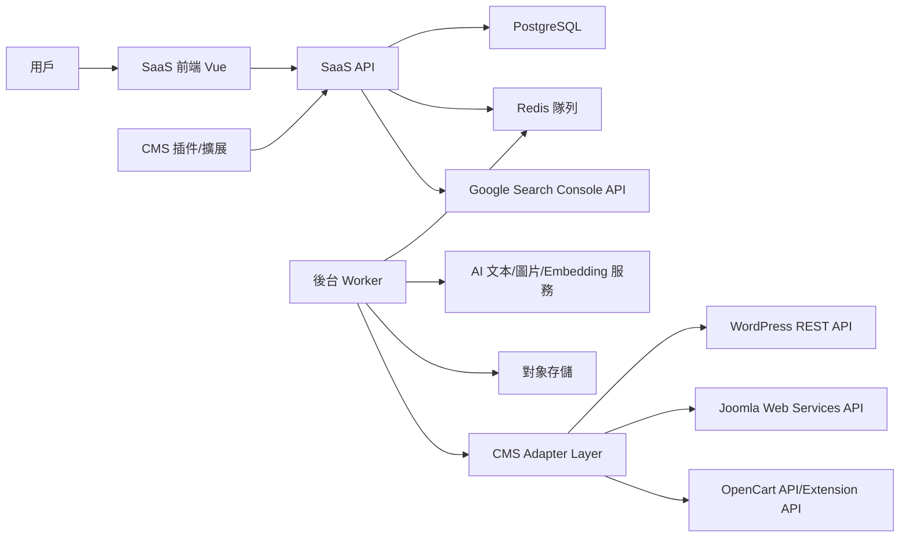

# AI SEO 自動優化平台開發需求文件

生成日期：2026-07-25

## 1. 背景與假設

你想做的是一個面向網站站長、內容團隊和 SEO Agency 的自動 SEO 優化平台。用戶在自己的網站後台安裝插件，把網站與平台 API 連接後，可以同步現有文章和圖片，並用 AI 做標題、Meta Description、文章內容、配圖、圖片 Alt Text 和內部連結優化。

本文件按以下假設規劃：

- 第一階段只支援 WordPress，後續再擴展 Joomla、OpenCart、Shopify、Webflow、Wix 或自建站。
- 產品形態是“SaaS 雲端後台 + CMS 插件/擴展 + 統一 API 服務”。
- 預設不直接全自動發佈修改，而是生成優化建議，經用戶審核後應用。
- 重點服務英文和中文內容站、企業官網、博客、聯盟營銷站和 SEO Agency。
- 不承諾 Google 排名，只提供內容品質、站內結構和資料追蹤能力。

## 2. 域名和品牌

### 2.1 已定稿品牌

| 項目 | 內容 |
|---|---|
| 主品牌 | RankWoven |
| 主域名 | `rankwoven.com` |
| 域名狀態 | 已購買 |
| 中文品牌方向 | 排名織引 |

RankWoven 的品牌語義貼近“把文章、關鍵詞、圖片、內部連結和主題集群編織成可持續增長的 SEO 網絡”。相比只強調文章生成，它更適合覆蓋 SEO 審計、內容優化、圖片優化、內部連結、AEO、GEO 和 AI Search 可見性等後續產品線。

### 2.2 品牌使用規則

- 對外主品牌統一使用 `RankWoven`。
- 主站、SaaS 前台和產品登入入口統一使用 `rankwoven.com`。
- 中文市場可使用“RankWoven 排名織引”作為完整稱呼。
- 技術倉庫和內部 package 名稱可暫時保留 `AIEO`，避免第一階段做大規模重命名。
- Logo、前台文案、插件名稱和郵件模板後續應逐步改為 `RankWoven`。

### 2.3 原候選記錄

以下記錄保留作為早期命名決策依據，後續產品以 RankWoven 為準。

| 推薦級別 | 品牌 | 域名方向 | 狀態 | 推薦理由 |
|---|---|---|---|---|
| 已選定 | RankWoven | `rankwoven.com` | 已購買 | 與站內連結、內容編織和主題集群高度貼合 |
| 原首選候選 | RankLoom | `rankloom.ai` | 未採用 | 直接表達排名和內容網絡，適合主打內部連結、內容圖譜和 AI SEO |
| 原首選候選 | SeoLume | `seolume.ai` | 未採用 | 短、清楚、有“照亮 SEO 機會”的品牌感 |
| 原備選 | SearchCraftAI | `searchcraftai.com` | 未採用 | 產品用途清楚，適合 SEO 內容生成，但略長 |
| 原備選 | ContentLume | `contentlume.ai` | 未採用 | 適合從 SEO 擴展到內容增長平台 |
| 原備選 | AISearchPilot | `aisearchpilot.com` | 未採用 | 表達 AI 搜尋導航和自動駕駛感，但字符較多 |

## 3. 產品定位

### 3.1 一句話定位

通過插件連接網站，用 AI 掃描現有內容並生成可審核、可回滾的 SEO 優化建議，幫助網站持續改善文章、圖片和內部連結結構。

### 3.2 核心價值

- 節省人工逐篇檢查文章的時間。
- 讓非 SEO 專業用戶也能做基礎 On-page SEO。
- 幫助內容團隊發現舊文章的更新機會。
- 通過內部連結建議提升站內主題相關性。
- 通過 Search Console 資料追蹤優化前後的表現。

### 3.3 產品邊界

第一版做：

- 文章同步
- SEO 審計
- 標題和 Meta 優化
- 圖片 Alt Text 和文件名建議
- 關鍵詞生成文章草稿
- 內部連結推薦
- 人工審核後應用修改
- 任務日誌和回滾

第一版不做：

- 自動購買外鏈
- 自動抓取搜尋結果製造內容
- 大規模無審核自動發佈
- 保證排名
- 第一版同時支援所有 CMS
- 複雜白標 Agency 系統

## 4. 合規與搜尋品質原則

Google 官方說明中，生成式 AI 可以用於研究主題和增加內容結構，但如果大量生成沒有用戶價值的頁面，可能違反其關於規模化內容濫用的垃圾政策。產品必須圍繞“內容品質、準確性、相關性、用戶價值”設計，而不是圍繞“關鍵詞堆砌”和“批量鋪頁面”設計。

相關官方依據：

- Google Search 關於生成式 AI 內容的指引：<https://developers.google.com/search/docs/fundamentals/using-gen-ai-content>
- Google Search 垃圾內容政策：<https://developers.google.com/search/docs/essentials/spam-policies>
- Google 圖片 SEO 最佳實踐：<https://developers.google.com/search/docs/appearance/google-images>
- WordPress REST API 認證：<https://developer.wordpress.org/rest-api/using-the-rest-api/authentication/>
- Joomla Web Services API：<https://manual.joomla.org/docs/general-concepts/webservices/>
- OpenCart API 管理：<https://docs.opencart.com/admin-interface/system/users/api>
- Google Search Console API 授權：<https://developers.google.com/webmaster-tools/v1/how-tos/authorizing>

產品必須內置這些限制：

- AI 生成文章預設保存為草稿。
- 批量修改預設需要人工批准。
- 所有修改必須記錄修改前、修改後、操作者、時間和任務來源。
- 對過度關鍵詞重複、無來源事實、低原創性內容給出風險提示。
- 對內部連結數量、錨文本重複率、目標頁面分佈設置上限。
- 對圖片 Alt Text 禁止關鍵詞堆砌。
- 不提供“保證排名”類文案和報表。

## 5. 目標用戶與使用場景

### 5.1 網站站長

痛點：

- 不知道哪些舊文章需要優化。
- 沒時間逐篇補標題、描述和圖片 Alt。
- 不懂內部連結該怎麼做。

核心流程：

1. 安裝 WordPress 插件。
2. 連接 SaaS API。
3. 同步文章和媒體庫。
4. 查看 SEO 審計結果。
5. 批准優化建議。
6. 應用到 WordPress 並追蹤結果。

### 5.2 SEO Agency

痛點：

- 客戶網站多，人工巡檢成本高。
- 優化建議難以規模化交付。
- 報告製作耗時。

核心流程：

1. 創建客戶工作區。
2. 連接多個客戶站點。
3. 批量發起審計任務。
4. 分配編輯審核。
5. 導出優化報告和成效對比。

### 5.3 內容編輯

痛點：

- 缺少選題和關鍵詞方向。
- 標題和摘要不夠吸引點擊。
- 新文章發佈後缺少站內連結支援。

核心流程：

1. 輸入目標關鍵詞和語氣。
2. 生成標題、大綱和文章草稿。
3. 選擇配圖方向。
4. 自動推薦可連結舊文章。
5. 推送為 WordPress 草稿。

## 6. 核心功能需求

### 6.1 用戶與工作區

功能：

- 電子郵件註冊、登入、忘記密碼。
- 創建團隊工作區。
- 成員角色：Owner、Admin、Editor、Viewer。
- 每個工作區可連接多個網站。
- 每個套餐限制站點數、文章數、AI 用量和圖片生成數。

驗收標準：

- 用戶可以創建工作區並邀請成員。
- Editor 只能審核和編輯內容，不能修改帳單。
- Viewer 只能查看報告，不能執行修改。

### 6.2 網站連接

功能：

- WordPress 插件生成站點連接請求。
- 後續 Joomla Extension、OpenCart Extension 使用同一套站點連接流程。
- SaaS 後台顯示待連接站點。
- 用戶確認後生成站點 API Token。
- 插件端或擴展端保存 Token，不保存 SaaS 主帳號密碼。
- WordPress 用戶需自行在個人資料頁建立管理員 Application Password，並在插件或 SaaS 後台錄入。
- SaaS 只保存 WordPress 管理員用戶名與加密後 Application Password，用於後續以該管理員身份寫回已批准修改。
- 支援斷開連接和重新生成 Token。
- 站點記錄必須包含 `platform` 欄位，例如 `wordpress`、`joomla`、`opencart`。

驗收標準：

- 連接成功後，SaaS 能讀取站點基礎資訊。
- Token 洩露時可立即吊銷。
- Token 被吊銷或重生後，插件需提示重新填寫新 Token 或重新連接站點。
- 後續寫回 WordPress 時，修改應歸屬到用戶錄入的管理員身份，方便在 WordPress 端追蹤修改來源。
- 連接失敗時顯示明確原因，例如 HTTPS 不可用、REST API 被禁用、權限不足。
- 不同 CMS 的連接錯誤要保留平台差異，例如 Joomla API Token 權限不足、OpenCart API IP 白名單未配置。

### 6.3 文章同步

功能：

- 同步 WordPress Posts 和 Pages。
- 後續同步 Joomla Articles、Categories 和 OpenCart Information Pages、Categories、Products SEO 欄位。
- 同步欄位：標題、Slug、正文 HTML、摘要、Meta Description、分類、標籤、特色圖、發佈時間、更新時間、狀態、作者、URL。
- WordPress Meta Description 來源優先級：Yoast `_yoast_wpseo_metadesc`、Rank Math `rank_math_description`、AIOSEO `_aioseo_description` / `_aioseop_description`，沒有 SEO 插件欄位時回退 WordPress 摘要。
- 支援分頁同步和增量同步。
- 支援手動刷新單篇文章。
- 不同步回收站和私密文章，除非用戶明確授權。

驗收標準：

- 1,000 篇文章以內可穩定同步。
- 同步任務有進度、成功數、失敗數和錯誤原因。
- 同一文章重複同步不會產生重複記錄。
- 同一套文章列表頁可以展示不同 CMS 的內容來源，並清楚標記平台。

### 6.4 SEO 審計

審計維度：

- 標題長度、關鍵詞相關性、唯一性。
- Meta Description 是否缺失、過長、過短。
- H1 是否唯一。
- H2/H3 結構是否清晰。
- 正文長度和主題覆蓋度。
- 圖片是否缺少 Alt Text。
- 圖片文件名是否過於通用。
- 內部連結數量是否過少。
- 外部連結是否缺失或異常。
- Slug 是否可讀。
- Canonical 是否存在。
- Schema 標記是否存在。
- 過度關鍵詞重複風險。

輸出：

- SEO 分數。
- 問題列表。
- 優先級：高、中、低。
- 建議動作。
- 可自動修復項和需人工判斷項。

驗收標準：

- 每篇文章能生成審計報告。
- 每個問題有明確位置和修改建議。
- 批量審計可以排隊執行，不阻塞用戶界面。

### 6.5 標題和 Meta 優化

功能：

- 基於主關鍵詞生成 5 個標題候選。
- 基於文章內容生成 3 個 Meta Description 候選。
- 顯示字符長度、關鍵詞覆蓋、點擊吸引力評分。
- 支援用戶編輯候選。
- 支援通過 CMS 適配器應用到 WordPress，後續擴展到 Joomla、OpenCart。

驗收標準：

- 標題和描述不會覆蓋原文，必須先保存為建議。
- 用戶可以對比修改前後。
- 應用失敗時不會丟失建議內容。

### 6.6 文章生成

功能：

- 用戶輸入關鍵詞、目標地區、語言、文章類型和語氣。
- 系統生成標題、搜尋意圖分析、大綱、正文、FAQ 和內部連結建議。
- 支援生成 WordPress 草稿；後續 Joomla 生成未發佈文章，OpenCart 生成資訊頁或產品 SEO 草稿。
- 支援引用資料輸入，但第一版不自動抓取搜尋結果批量改寫。

驗收標準：

- 生成內容預設進入草稿狀態。
- 生成前展示預估 AI 用量。
- 生成結果可以人工編輯後再發布。
- 涉及醫療、法律、金融等高風險主題時顯示人工審核提示。

### 6.7 圖片優化與配圖

功能：

- 掃描文章中的圖片。
- 識別缺失 Alt Text、標題、說明文字和描述性文件名的問題。
- 根據文章上下文生成 Alt Text 建議。
- 根據關鍵詞生成配圖提示詞。
- 可調用圖片生成服務生成特色圖。
- 上傳圖片到 WordPress 媒體庫；後續按平台能力上傳到 Joomla Media Manager 或 OpenCart Image 目錄。
- 生成 WebP 或壓縮版本。

驗收標準：

- Alt Text 必須描述圖片內容，不能只堆關鍵詞。
- 圖片上傳失敗時保留任務日誌。
- 生成圖片必須標記來源，便於後續審計。

### 6.8 內部連結推薦

功能：

- 為每篇文章提取主題、關鍵詞和實體。
- 建立站內內容圖譜。
- 推薦可連結目標文章。
- 推薦錨文本。
- 控制單篇新增連結數量。
- 避免重複連結、無關連結和過度優化錨文本。
- 支援用戶逐條批准或批量批准。

驗收標準：

- 每條推薦包含來源段落、目標 URL、推薦錨文本和推薦理由。
- 已存在連結不會重複插入。
- 同一目標頁面不會被過度集中連結。
- 插入後保留可回滾記錄。

### 6.9 任務隊列

功能：

- 審計、同步、生成、優化、發佈都作為任務執行。
- 支援任務狀態：Pending、Running、Succeeded、Failed、Cancelled。
- 支援重試和取消。
- 支援任務日誌。
- 支援失敗原因分類。

驗收標準：

- 用戶刷新頁面後仍能看到任務進度。
- 失敗任務不會無限重試。
- 批量任務能統計成功數和失敗數。

### 6.10 差異對比與回滾

功能：

- 展示標題、Meta、正文、圖片欄位和內鏈變更差異。
- 保存修改前快照。
- 支援一鍵回滾到指定版本。
- 支援只應用部分建議。

驗收標準：

- 每次應用到 CMS 前必須創建快照。
- 回滾失敗時顯示失敗原因。
- 用戶可查看歷史優化記錄。

### 6.11 資料追蹤

功能：

- 接入 Google Search Console OAuth。
- 拉取頁面級查詢、點擊、曝光、CTR、平均排名。
- 展示優化前後 7 天、28 天、90 天趨勢。
- 標記每次優化事件。

驗收標準：

- 用戶授權後可選擇 Search Console Property。
- 頁面詳情能顯示該 URL 的搜尋表現。
- 報表說明資料有延遲和抽樣限制，不把相關性誤寫成因果保證。

## 7. 非功能需求

### 7.1 安全

- 所有 API 使用 HTTPS。
- SaaS Token、WordPress Token 和第三方 API Key 加密存儲。
- 後端不記錄完整 Token、密碼或用戶隱私資料。
- 所有外部輸入必須驗證。
- 插件端請求必須校驗簽名和權限。
- 批量修改必須有權限控制。

### 7.2 性能

- 文章同步使用分頁。
- 大任務進入隊列。
- 列表頁預設分頁。
- 內容向量化異步執行。
- 報表資料按站點和日期緩存。

### 7.3 可用性

- 任務失敗可重試。
- 修改應用失敗不影響本地建議記錄。
- 插件離線時 SaaS 顯示連接異常。
- 後台必須有空狀態、Loading 狀態和錯誤提示。

### 7.4 可觀測性

- 記錄請求 ID、用戶 ID、站點 ID、任務 ID、狀態碼、耗時和錯誤碼。
- AI 請求記錄模型、輸入長度、輸出長度、成本估算和失敗原因。
- 不記錄完整文章內容到普通日誌。

## 8. 系統架構



推薦拆分：

- `apps/web`：SaaS 前端。
- `apps/api`：後端 API。
- `apps/worker`：任務 Worker。
- `plugins/wordpress`：WordPress 插件。
- `plugins/joomla`：Joomla 擴展。
- `plugins/opencart`：OpenCart 擴展。
- `packages/cms-adapters`：CMS 適配器介面和各平台實現。
- `packages/shared`：共享類型、錯誤碼和工具。

### 8.1 CMS 適配器層

為了後續支援 Joomla、OpenCart 等常用系統，核心業務服務不直接依賴某一個 CMS 的 API，而是調用統一的 `CmsAdapter` 介面。

建議介面能力：

```ts
export interface CmsAdapter {
  getSiteInfo(): Promise<CmsSiteInfo>;
  listContent(params: ContentListParams): Promise<PaginatedResult<CmsContentItem>>;
  getContent(contentId: string): Promise<CmsContentDetail>;
  previewUpdate(contentId: string, payload: CmsUpdatePayload): Promise<CmsPreviewResult>;
  applyUpdate(contentId: string, payload: CmsUpdatePayload): Promise<CmsApplyResult>;
  rollbackContent(contentId: string, snapshotId: string): Promise<CmsRollbackResult>;
  listMedia(params: MediaListParams): Promise<PaginatedResult<CmsMediaItem>>;
  uploadMedia(payload: CmsUploadMediaPayload): Promise<CmsMediaItem>;
}
```

適配器設計原則：

- WordPress、Joomla、OpenCart 各自處理認證、欄位映射和 API 限制。
- SaaS 核心流程只認識文章、媒體、快照、建議、任務等通用模型。
- 不同 CMS 不支援的能力要返回明確的 `FEATURE_NOT_SUPPORTED` 錯誤碼。
- 每個 CMS 適配器都要有連接診斷功能，檢查 API 可用性、權限、版本和必要擴展。

### 8.2 平台支援優先級

| 階段 | 平台 | 內容範圍 | 主要原因 |
|---|---|---|---|
| MVP | WordPress | Posts、Pages、Media | 市場最大，插件生態成熟，REST API 完整 |
| Phase 2 | Joomla | Articles、Categories、Media | 常見企業站和內容站，官方提供 Web Services API |
| Phase 3 | OpenCart | Products SEO、Categories、Information Pages、Images | 電商站需要產品標題、描述、圖片 Alt 和分類內鏈優化 |
| Phase 4 | Shopify / Webflow | Products、Collections、Pages、Blog Posts | 便於打入海外 SaaS 和電商市場 |

### 8.3 Joomla 擴展需求

功能：

- 支援 Joomla 4/5。
- 通過 Joomla Web Services API 或自建 Extension Endpoint 連接。
- 同步 Articles、Categories、Tags、Media。
- 支援文章標題、Alias、Meta Description、Meta Keywords、正文、圖片 Alt Text 的優化建議。
- 支援生成未發佈文章，等待用戶在 Joomla 後台審核。
- 支援應用前快照和回滾。

驗收標準：

- Joomla 站點可完成連接診斷。
- 文章列表可同步到 SaaS。
- 標題、Meta 和正文建議可套用到指定文章。
- 權限不足、API Token 錯誤、Web Services 未啟用時有明確提示。

### 8.4 OpenCart 擴展需求

功能：

- 支援 OpenCart 3.x 和 4.x 的常見安裝形態。
- 通過 OpenCart API 和自建 Extension Endpoint 連接。
- 同步 Products、Categories、Information Pages 和 Images。
- 優化產品名稱、Meta Title、Meta Description、Meta Keywords、SEO URL、產品描述、分類描述、圖片 Alt Text。
- 支援為產品頁推薦相關產品、分類頁、資訊頁的內部連結。
- 支援生成產品 SEO 描述草稿，但不直接改價格、庫存、訂單或支付資料。

驗收標準：

- OpenCart 站點可完成連接診斷。
- 產品 SEO 欄位可同步、預覽、應用和回滾。
- API IP 白名單、Token 錯誤、Extension 未安裝時有明確提示。
- 系統不會修改商品價格、庫存、客戶資料和訂單資料。

## 9. 資料模型草案

### 9.1 核心表

- `users`：用戶。
- `workspaces`：工作區。
- `workspace_members`：成員與角色。
- `sites`：已連接網站。
- `site_tokens`：站點訪問憑證。
- `articles`：同步文章。
- `media_assets`：圖片和媒體。
- `seo_audits`：審計報告。
- `optimization_suggestions`：優化建議。
- `content_snapshots`：應用前快照。
- `internal_link_suggestions`：內部連結建議。
- `tasks`：任務隊列記錄。
- `search_console_connections`：Search Console 授權。
- `search_metrics`：頁面搜尋表現。
- `usage_records`：AI 和功能用量。

### 9.2 關鍵狀態

文章同步狀態：

```text
synced
pending_review
optimized
publish_failed
rollback_required
```

建議狀態：

```text
draft
approved
rejected
applied
rolled_back
failed
```

任務狀態：

```text
pending
running
succeeded
failed
cancelled
```

## 10. API 草案

所有 API 使用統一響應格式：

```json
{
  "success": true,
  "message": "操作成功",
  "data": {}
}
```

失敗響應：

```json
{
  "success": false,
  "message": "操作失敗",
  "error": {
    "code": "VALIDATION_ERROR",
    "details": "欄位 siteId 不能為空"
  }
}
```

### 10.1 SaaS API

| Method | URL | 用途 |
|---|---|---|
| `POST` | `/api/v1/auth/login` | 登入 |
| `GET` | `/api/v1/workspaces` | 獲取工作區 |
| `POST` | `/api/v1/site-connections` | 創建站點連接 |
| `GET` | `/api/v1/site-connections` | 獲取站點列表 |
| `GET` | `/api/v1/site-connections/:siteId` | 獲取站點詳情 |
| `PUT` | `/api/v1/site-connections/:siteId/wordpress-credentials` | 保存 WordPress 管理員用戶名和加密後 Application Password |
| `POST` | `/api/v1/site-connections/:siteId/token/regenerate` | 重新生成站點 API Token，舊 Token 立即失效 |
| `POST` | `/api/v1/site-connections/:siteId/token/revoke` | 吊銷站點 API Token，站點狀態改為 `revoked` |
| `POST` | `/api/v1/site-connections/:siteId/sync` | 舊版單次同步兼容接口 |
| `POST` | `/api/v1/site-connections/:siteId/sync-tasks` | 建立同步任務，可帶 `updatedAfter` |
| `GET` | `/api/v1/sync-tasks` | 獲取最近同步任務列表，包含任務範圍、目標 CMS ID 和 batch 進度 |
| `GET` | `/api/v1/site-connections/:siteId/sync-tasks` | 獲取單個站點的同步任務列表 |
| `POST` | `/api/v1/site-connections/:siteId/manual-refresh` | 為單篇文章或單個媒體建立手動刷新任務 |
| `POST` | `/api/v1/site-connections/:siteId/sync-tasks/:syncTaskId/batches` | 接收插件分頁推送的文章與媒體同步批次 |
| `GET` | `/api/v1/site-connections/:siteId/articles?page=&pageSize=&search=&status=&issue=` | 帶 Bearer Token 或登入用戶權限獲取已同步文章分頁列表；`issue` 支援 `missing_meta`、`missing_featured_image` |
| `GET` | `/api/v1/site-connections/:siteId/media?page=&pageSize=&search=&issue=` | 帶 Bearer Token 或登入用戶權限獲取已同步媒體分頁列表；`issue` 支援 `missing_alt`、`missing_file_name` |
| `POST` | `/api/v1/site-connections/:siteId/audits` | 執行站點 SEO 規則審計並生成建議 |
| `GET` | `/api/v1/site-connections/:siteId/audits` | 獲取站點 SEO 審計記錄和最近問題 |
| `GET` | `/api/v1/site-connections/:siteId/suggestions` | 獲取文章與媒體優化建議 |
| `POST` | `/api/v1/site-connections/:siteId/suggestions` | 手動建立優化建議 |
| `POST` | `/api/v1/site-connections/:siteId/suggestions/:suggestionId/approve` | 批准優化建議 |
| `POST` | `/api/v1/site-connections/:siteId/suggestions/:suggestionId/apply` | 為已批准建議建立 WordPress 寫回任務 |
| `GET` | `/api/v1/analytics/overview?siteId=&startDate=&endDate=` | 讀取 GA4 或示範分析數據，支援站點 host 篩選與日期範圍 |
| `GET` | `/api/v1/articles/:articleId` | 獲取文章詳情 |
| `POST` | `/api/v1/articles/:articleId/audit` | 舊規劃路由，後續按站點路由整合 |
| `POST` | `/api/v1/articles/:articleId/suggestions` | 舊規劃路由，後續按站點路由整合 |
| `POST` | `/api/v1/suggestions/:suggestionId/apply` | 舊規劃路由，後續按站點路由整合 |
| `POST` | `/api/v1/articles/:articleId/rollback` | 回滾文章 |
| `POST` | `/api/v1/articles/generate` | 生成文章草稿 |
| `GET` | `/api/v1/tasks/:taskId` | 查詢任務狀態 |
| `POST` | `/api/v1/search-console/connect` | 連接 Search Console |
| `GET` | `/api/v1/ai-providers` | 查看當前 AI、Embedding、圖片、媒體存儲與圖片優化 Provider 配置 |

### 10.2 WordPress 插件 API

插件需要提供站點側介面：

| Method | URL | 用途 |
|---|---|---|
| `GET` | `/wp-json/rankwoven/v1/site` | 獲取站點基礎資訊 |
| `GET` | `/wp-json/rankwoven/v1/posts` | 分頁讀取文章，支援 `updatedAfter` |
| `GET` | `/wp-json/rankwoven/v1/posts/:id` | 讀取單篇文章 |
| `POST` | `/wp-json/rankwoven/v1/posts/:id/preview` | 預覽修改，後續實現 |
| `POST` | `/wp-json/rankwoven/v1/posts/:id/apply` | 應用已批准文章修改，使用 WordPress Application Password 身份 |
| `POST` | `/wp-json/rankwoven/v1/posts/:id/rollback` | 回滾修改，後續實現 |
| `GET` | `/wp-json/rankwoven/v1/media` | 分頁讀取媒體，支援 `updatedAfter` |
| `GET` | `/wp-json/rankwoven/v1/media/:id` | 讀取單個圖片媒體 |
| `POST` | `/wp-json/rankwoven/v1/media/:id/apply` | 應用已批准媒體標題、Alt Text 或檔名建議 |
| `POST` | `/wp-json/rankwoven/v1/media` | 上傳圖片，後續實現 |

### 10.3 Joomla 擴展 API

Joomla 擴展可以優先調用官方 Web Services API；若站點環境限制較多，則提供自建命名空間介面，並在 SaaS 端統一包裝為 `JoomlaAdapter`。

| Method | URL | 用途 |
|---|---|---|
| `GET` | `/api/index.php/v1/aieo/site` | 獲取站點基礎資訊 |
| `GET` | `/api/index.php/v1/aieo/articles` | 分頁讀取文章 |
| `GET` | `/api/index.php/v1/aieo/articles/:id` | 讀取單篇文章 |
| `POST` | `/api/index.php/v1/aieo/articles/:id/preview` | 預覽修改 |
| `POST` | `/api/index.php/v1/aieo/articles/:id/apply` | 應用修改 |
| `POST` | `/api/index.php/v1/aieo/articles/:id/rollback` | 回滾修改 |
| `GET` | `/api/index.php/v1/aieo/media` | 分頁讀取媒體 |
| `POST` | `/api/index.php/v1/aieo/media` | 上傳圖片 |

### 10.4 OpenCart 擴展 API

OpenCart 擴展要特別限制可修改欄位，避免 SEO 任務誤改商品價格、庫存、訂單和客戶資料。

| Method | URL | 用途 |
|---|---|---|
| `GET` | `/index.php?route=extension/aieo/site` | 獲取站點基礎資訊 |
| `GET` | `/index.php?route=extension/aieo/products` | 分頁讀取產品 |
| `GET` | `/index.php?route=extension/aieo/products/:id` | 讀取單個產品 SEO 資料 |
| `POST` | `/index.php?route=extension/aieo/products/:id/preview` | 預覽產品 SEO 修改 |
| `POST` | `/index.php?route=extension/aieo/products/:id/apply` | 應用產品 SEO 修改 |
| `POST` | `/index.php?route=extension/aieo/products/:id/rollback` | 回滾產品 SEO 修改 |
| `GET` | `/index.php?route=extension/aieo/categories` | 分頁讀取分類 |
| `GET` | `/index.php?route=extension/aieo/information` | 分頁讀取資訊頁 |
| `GET` | `/index.php?route=extension/aieo/images` | 分頁讀取圖片 |

## 11. 前端頁面需求

### 11.1 登入頁

- 電子郵件、密碼登入。
- 表單驗證。
- 登入失敗提示。

### 11.2 站點列表

- 展示已連接站點。
- 顯示連接狀態、文章數、最近同步時間、SEO 平均分。
- 支援新增站點。

### 11.3 站點儀表板

- SEO 總分趨勢。
- 待處理高優先級問題。
- 最近任務。
- Search Console 表現摘要。

### 11.4 文章列表

- 支援搜尋、篩選、分頁。
- 顯示標題、狀態、SEO 分數、內部連結數、圖片問題數。
- 支援批量審計。

### 11.5 優化審核頁

- 左側展示原文。
- 右側展示 AI 建議。
- 支援差異對比。
- 支援逐項批准。
- 支援應用到 WordPress。

### 11.6 內部連結頁

- 展示來源文章、目標文章、錨文本、推薦理由。
- 支援批准、拒絕、編輯錨文本。

### 11.7 文章生成頁

- 輸入關鍵詞、語言、目標讀者、文章類型、語氣。
- 生成標題、大綱、正文和圖片提示詞。
- 支援推送為 WordPress 草稿。

### 11.8 SaaS 前台與工具頁參考

前台網站可參考 AITDK 的產品資訊架構和工具型排版，但不得照抄其品牌、文案、圖片、配色和頁面細節。參考重點是它將 SEO 工具拆成可獨立進入的生成器頁面，並用清楚的 Hero、輸入框、工具集合、功能說明、FAQ 和 CTA 引導用戶快速試用。

可參考的功能入口：

- SEO Title Generator：標題生成。
- SEO Description Generator：Meta Description 生成。
- SEO Keywords Generator：關鍵詞生成。
- FAQ Generator：FAQ 內容生成。
- Feature Generator：產品或服務賣點生成。
- Testimonial Generator：評價內容生成。
- AI Rewriter：既有內容改寫。
- AI Landing Page Generator：落地頁內容生成。
- SEO Extension：瀏覽器插件或網站分析插件入口。
- Pricing：套餐和用量說明。

建議前台頁面結構：

1. 首屏 Hero

   - 左側或中間顯示產品名稱、定位文案和主 CTA。
   - CTA 使用「免費開始優化」和「查看插件」兩個動作。
   - 首屏放一個可互動的 SEO 輸入框，讓用戶輸入網址、文章標題或關鍵詞。
   - 顯示可輸出的結果類型，例如標題、描述、關鍵詞、FAQ、內部連結建議。

2. 工具集合區

   - 使用 2 到 3 欄網格展示獨立工具。
   - 每個工具卡片包含工具名稱、適用場景、輸入內容、輸出內容和「Generate」動作。
   - 工具入口要能獨立分享和被搜尋引擎收錄。
   - MVP 優先提供標題生成、描述生成、關鍵詞生成、FAQ 生成和文章改寫。

3. 功能詳解區

   - 以編號區塊展示核心能力，例如 `01 標題優化`、`02 Meta 優化`、`03 關鍵詞建議`、`04 FAQ 生成`、`05 內部連結`、`06 CMS 發佈`。
   - 每個區塊包含 3 個短要點，並配一個工具預覽或結果預覽。
   - 內容要聚焦實際工作流，不做空泛行銷敘述。

4. SaaS 工作台預覽

   - 展示站點概覽、文章列表、SEO 分數、待審核建議和任務進度。
   - 強調「先預覽、再批准、可回滾」。
   - 呈現 WordPress、Joomla、OpenCart 的平台狀態。

5. 使用流程區

   - 第一步：安裝插件或擴展。
   - 第二步：連接 SaaS API。
   - 第三步：同步文章和圖片。
   - 第四步：生成 SEO 建議。
   - 第五步：審核後套用並追蹤效果。

6. Pricing 區

   - 至少包含 Free、Pro、Agency 三個套餐。
   - 套餐差異以站點數、文章同步量、AI 生成量、圖片生成量、團隊成員和白標報告區分。
   - 價格頁必須清楚說明 AI 用量限制和超額規則。

7. FAQ 區

   - 解釋 AI 內容是否安全、是否保證排名、是否會自動改站、如何回滾、支援哪些 CMS、用量如何計算。
   - FAQ 文案必須直接回答疑問，不使用誇大排名承諾。

8. 底部 CTA

   - 提供「連接第一個網站」和「查看 WordPress 插件」。
   - 若未登入，引導註冊；若已登入，引導到站點連接流程。

視覺與互動要求：

- 前台可比後台更有品牌感，但不要做純展示型 landing page；首屏必須提供可操作的輸入或明確產品入口。
- 工具頁採用「輸入表單 + 結果預覽 + 可複製/保存/推送」的固定結構。
- 常用工具以 Tabs 或分類導覽分組，例如「SEO 生成器」、「內容改寫」、「落地頁」、「CMS 插件」。
- 每個生成器都要有 Loading、空狀態、錯誤狀態和用量提示。
- 生成結果必須支援複製、保存為建議、推送到文章草稿。
- 行動端優先保證表單可用，工具卡片改為單欄排列。
- 不使用過度裝飾的漸層背景；後台仍保持安靜、密集、適合反覆工作的 SaaS 風格。

### 11.9 多語言與 i18n 要求

前端必須使用 `vue-i18n` 建立多語言架構，避免在 Vue 模板和 TypeScript 邏輯中寫死顯示文字。前台、登入頁、工具頁、Pricing、Extension 介紹頁和登入後 SaaS 工作台都要走同一套 i18n 訊息管理。

第一批語言：

- English：`en`
- Deutsch：`de`
- Français：`fr`
- Italiano：`it`
- 中文：`zh-CN`
- 繁體中文：`zh-Hant`
- 日本語：`ja`
- 한국어：`ko`
- Português：`pt`
- Español：`es`
- Русский：`ru`

語言切換器需求：

- 位置：桌面端放在右上角；行動端可放入頂部導覽或抽屜選單。
- 樣式：使用地球圖示、當前語言名稱、下拉箭頭；選單顯示完整語言名稱，當前語言以勾號標記。
- 狀態：切換後立即更新頁面文字，並保存到 `localStorage`。
- 預設：首次訪問優先讀取瀏覽器語言；不支援時 fallback 到 `zh-Hant`，再 fallback 到 `en`。
- URL 策略：MVP 可先不加語言前綴；正式 SEO 前台建議支援 `/en/`、`/de/`、`/zh-hant/` 等語言路徑，並輸出 `hreflang`。
- SEO：每個工具頁的 title、description、canonical、Open Graph 和 Schema 文字都要支援多語言。
- 表單：錯誤提示、Loading、空狀態、成功提示和用量提示都必須走 i18n。
- 內容生成：用戶選擇語言後，AI 生成結果要預設使用當前介面語言，但允許在生成表單中單獨指定文章語言。
- 翻譯維護：文案 key 採用模塊化命名，例如 `nav.dashboard`、`tools.titleGenerator.inputLabel`、`pricing.pro.description`。

### 11.10 前台路由建議

- `/`：首頁，展示 Hero、工具集合、工作流、Pricing 摘要和 FAQ。
- `/tools`：AI SEO 工具集合。
- `/tools/title-generator`：SEO 標題生成器。
- `/tools/description-generator`：SEO 描述生成器。
- `/tools/keywords-generator`：關鍵詞生成器。
- `/tools/faq-generator`：FAQ 生成器。
- `/tools/content-rewriter`：內容改寫工具。
- `/tools/landing-page-generator`：落地頁內容生成器。
- `/extension`：WordPress/Joomla/OpenCart 插件與擴展介紹。
- `/pricing`：套餐價格。
- `/login`：登入。
- `/sites`：登入後站點工作台。

## 12. AI 與圖片服務商建議

本平台不應把業務邏輯直接綁死在單一模型 API 上。MVP 可以先接入一個主供應商和一個備援供應商，但後端設計必須保留 `TextGenerationProvider`、`EmbeddingProvider`、`ImageGenerationProvider`、`MediaStorageProvider` 和 `ImageOptimizationProvider` 適配器，方便後續按成本、品質、地區可用性和客戶合規要求切換。

### 12.1 MVP 首選組合

| 類型 | 首選服務商 | 用途 | 推薦原因 | 注意事項 |
|---|---|---|---|---|
| AI 文字生成 | 問問 API 代理 | SEO 標題、Meta Description、文章大綱、文章草稿、內容改寫、結構化 JSON 輸出 | 問問 API 文檔提供 OpenAI 兼容格式，可通過同一 Base URL 調用 OpenAI、Google Gemini、DeepSeek 等模型，MVP 整合成本最低 | 所有生成內容預設進入草稿和人工審核，不直接批量發佈 |
| Embedding | 問問 API 代理 | 文章相似度、內部連結推薦、內容聚類、重複內容檢查 | 使用 OpenAI 兼容 `/v1/embeddings` 接口，首版可沿用現有 Embedding 抽象 | Embedding 結果要緩存；文章內容未變更時不可重複計費 |
| AI 備援/高品質長文 | 問問 API 代理下的 OpenAI/Claude/Gemini 模型 | 長文改寫、審稿、品質評分、風險檢查 | 先通過代理層切換模型，減少多套官方 SDK、密鑰和帳單邏輯 | 需記錄實際模型名；高價套餐才開放更高成本模型 |
| 成本優化文字模型 | 問問 API 代理下的 DeepSeek 或 Gemini 模型 | 批量標題改寫、低風險 Meta 生成、草稿初稿 | 可在同一代理接口下按任務選擇成本模型 | 需建立品質評分與抽樣審核，不合格時回退到主模型 |
| 圖片生成 | 問問 API 代理下的 Google Gemini 或 OpenAI 圖片模型 | 文章特色圖、社交分享圖、工具頁示例圖 | 使用 OpenAI 兼容 `/v1/images/generations` 接口，與文字生成共用代理密鑰和調用日誌 | 每張圖片必須保存 prompt、模型、生成時間和審核狀態 |
| 圖片商用安全備選 | Adobe Firefly Services | 品牌客戶、電商和代理商需要更強商用授權敘事時使用 | Adobe 官方定位偏企業內容生產和商用安全，適合高價套餐或企業客戶 | API 接入、速率和商務條款需在正式採購前確認 |
| 圖片存儲 | 七牛雲 Kodo | 保存 AI 生成原圖、壓縮圖、站點同步媒體備份 | 七牛 Kodo 提供對象存儲、上傳憑證和資源管理 API，適合國內圖片存儲與 CDN 場景 | 需要配置 Bucket、Region、公開域名和上傳 Token；不可把 AK/SK 暴露給前端 |
| 圖片優化/CDN | Cloudinary | 圖片壓縮、格式轉換、裁切、響應式尺寸、媒體管理 | 圖片 API、轉換和 CDN 成熟，可快速提供 WebP/AVIF、縮圖和自動裁切 | 成本按用量和方案增加；MVP 可先只在付費套餐啟用 |

### 12.2 分階段接入建議

Phase 1 MVP：

- 接入問問 API 作為 `primaryTextProvider`、`embeddingProvider` 和 `primaryImageProvider`。
- 文字模型首版支持 OpenAI、Google Gemini、DeepSeek 中的可用模型，通過 `WENWEN_TEXT_MODEL` 切換。
- Embedding 通過問問 API 的 OpenAI 兼容 Embedding 接口調用，通過 `WENWEN_EMBEDDING_MODEL` 切換。
- 圖片生成通過問問 API 的 OpenAI 兼容圖片接口調用，通過 `WENWEN_IMAGE_MODEL` 切換。
- 使用七牛雲 Kodo 保存生成圖片、原圖備份和任務產物。
- 暫不把 OpenRouter、Replicate、Adobe Firefly 做成用戶可選項，只保留適配器設計。

Phase 2 成本與品質優化：

- 增加 Claude 作為高品質審稿和長文改寫供應商。
- 增加 Gemini Flash/Lite 或 DeepSeek 作為批量低成本文本任務供應商。
- 建立模型路由規則：按任務類型、套餐等級、語言、成本上限和失敗重試選擇模型。
- 引入 Cloudinary 或 ImageKit 做圖片轉換、壓縮和 CDN。

Phase 3 企業與多模型：

- 接入 Adobe Firefly Services，服務需要商用安全、品牌治理或企業合約的客戶。
- 接入 Replicate 作為模型實驗場，測試 Flux、Recraft、Ideogram 等不同圖像模型。
- 評估 OpenRouter 作為模型聚合和 fallback 層，但不作為核心唯一入口，避免價格、路由和供應商可觀測性被中間層遮蔽。

### 12.3 不建議第一階段作為核心依賴

| 服務商 | 不建議首發核心依賴的原因 | 適合何時使用 |
|---|---|---|
| OpenRouter | 方便聚合多模型，但會增加模型路由、成本歸因、故障定位和資料流向審計複雜度 | Phase 3 多模型 marketplace 或內部模型評測 |
| Replicate | 模型選擇多，適合快速試驗，但生產穩定性、延遲和成本會因模型而異 | 圖片模型 A/B Test、風格探索、非核心功能 |
| Stability AI | 適合風格化圖片、開源模型體系和圖片編輯，但首版 SEO SaaS 不需要太多風格模型 | 需要 Stable Diffusion 生態、局部重繪、特殊風格時 |
| Midjourney | 視覺品質高，但正式 API、自動化、審計和商業工作流可控性不適合 MVP 核心鏈路 | 人工設計參考，不放入 SaaS 自動流程 |

### 12.4 Provider Adapter 設計要求

後端應提供統一供應商接口，業務服務只描述任務，不直接拼接某個供應商的請求格式。

建議接口：

- `TextGenerationProvider`：`generateTitle`、`generateMetaDescription`、`generateOutline`、`generateArticleDraft`、`rewriteContent`、`scoreContentQuality`。
- `EmbeddingProvider`：`embedText`、`embedArticleChunk`、`embedKeyword`。
- `ImageGenerationProvider`：`generateFeaturedImage`、`generateSocialImage`、`editImage`。
- `MediaStorageProvider`：`uploadOriginal`、`uploadVariant`、`getSignedUrl`、`deleteAsset`。
- `ImageOptimizationProvider`：`resizeImage`、`convertFormat`、`compressImage`、`generateResponsiveVariants`。

每次 AI 或圖片調用必須記錄：

- `provider`、`model`、`operation`、`siteId`、`userId`。
- 輸入 token、輸出 token、圖片張數、估算成本。
- prompt 版本、語言、關鍵字、審核狀態。
- 失敗原因、重試次數、fallback 供應商。
- 生成圖片的原始 prompt、負面 prompt、尺寸、格式和授權備註。

### 12.5 環境變量建議

```text
AI_TEXT_PROVIDER=wenwen
AI_FALLBACK_TEXT_PROVIDER=wenwen
AI_EMBEDDING_PROVIDER=wenwen
AI_IMAGE_PROVIDER=wenwen
AI_IMAGE_FALLBACK_PROVIDER=wenwen
MEDIA_STORAGE_PROVIDER=qiniu-kodo
IMAGE_OPTIMIZATION_PROVIDER=cloudinary

WENWEN_API_BASE_URL=https://breakout.wenwen-ai.com
WENWEN_API_KEY=
WENWEN_TEXT_MODEL=gpt-4.1-mini
WENWEN_EMBEDDING_MODEL=text-embedding-3-small
WENWEN_IMAGE_MODEL=gemini-2.5-flash-image
KEYWORD_VOLUME_API_URL=
KEYWORD_VOLUME_API_KEY=
QINIU_ACCESS_KEY=
QINIU_SECRET_KEY=
QINIU_BUCKET=
QINIU_REGION=
QINIU_PUBLIC_DOMAIN=
CLOUDINARY_CLOUD_NAME=
CLOUDINARY_API_KEY=
CLOUDINARY_API_SECRET=
```

### 12.6 成本控制要求

- 生成前必須顯示預估 AI 用量和圖片生成張數。
- 每個套餐必須限制每月文本 token、Embedding token、圖片生成張數和圖片存儲容量。
- 批量任務必須支持每日上限、單站點上限和失敗熔斷。
- 相同文章內容、相同關鍵字、相同 prompt 版本的審計結果應可緩存。
- 低價套餐使用成本模型；高價套餐可使用高品質模型；企業套餐才開放 Adobe Firefly 或多供應商策略。
- 圖片生成失敗時，不應阻塞文字 SEO 優化任務；應在任務日誌中標記圖片失敗並允許重試。

### 12.7 參考來源

- 問問 API 接口文檔：<https://breakoutapi.apifox.cn/>
- 問問 API OpenAI 兼容 Base URL：<https://breakout.wenwen-ai.com>
- 七牛雲 Kodo API 概覽：<https://developer.qiniu.com/kodo/1731/api-overview>
- OpenAI API Pricing：<https://platform.openai.com/docs/pricing>
- OpenAI Embeddings：<https://platform.openai.com/docs/guides/embeddings>
- Anthropic Claude Pricing：<https://docs.anthropic.com/en/docs/about-claude/pricing>
- Google Gemini API Pricing：<https://ai.google.dev/gemini-api/docs/pricing>
- DeepSeek API Pricing：<https://api-docs.deepseek.com/quick_start/pricing/>
- Stability AI Pricing：<https://platform.stability.ai/pricing>
- Adobe Firefly API：<https://developer.adobe.com/firefly-services/docs/firefly-api/>
- Adobe Firefly API Usage Notes：<https://developer.adobe.com/firefly-services/docs/firefly-api/getting-started/usage-notes/>
- Replicate Pricing：<https://replicate.com/pricing>
- Cloudinary Pricing：<https://cloudinary.com/pricing>

## 13. MVP 開發步驟

### 第 0 階段：產品定稿

目標：把範圍固定下來，避免邊做邊膨脹。

任務：

1. 確認品牌名和域名。
2. 確認第一版只支援 WordPress。
3. 確認後續 CMS 支援順序：Joomla、OpenCart、Shopify/Webflow。
4. 確認套餐限制和目標用戶。
5. 確認 AI 服務商和圖片服務商。

驗證：

- 輸出最終 PRD。
- 輸出 MVP 功能清單。
- 輸出不做事項清單。

### 第 1 階段：專案初始化

目標：建立可開發、可測試、可部署的基礎專案。

任務：

1. 初始化 Monorepo。
2. 創建 Vue 3 前端。
3. 創建 Node.js API 服務。
4. 創建 Worker 服務。
5. 創建 WordPress 插件目錄。
6. 創建 `packages/cms-adapters`，先定義 `CmsAdapter` 介面。
7. 預留 `plugins/joomla` 和 `plugins/opencart` 目錄，先放 README 和介面約束，不寫功能程式碼。
8. 配置 ESLint、Prettier、TypeScript、Vitest。
9. 創建 `.env.example`。

驗證：

- `npm install` 成功。
- `npm run lint` 成功。
- `npm run test` 成功。
- 前端和後端能本地啟動。
- WordPress 適配器能通過同一套 `CmsAdapter` 介面編譯。

### 第 2 階段：帳號、工作區和站點連接

目標：用戶能登入並連接一個 WordPress 站點。

任務：

1. 實現用戶註冊登入。
2. 實現工作區。
3. 實現站點連接 Token。
4. 實現 WordPress 插件設置頁。
5. 插件調用 SaaS 完成連接。

驗證：

- 用戶能在 SaaS 看到已連接站點。
- Token 可吊銷。
- 連接失敗有明確錯誤提示。

### 第 3 階段：文章同步

目標：SaaS 能讀取 WordPress 文章庫存。

任務：

1. 插件提供分頁文章介面。
2. SaaS 發起同步任務。
3. Worker 分頁拉取文章。
4. 存儲文章正文和元資訊。
5. 前端展示文章列表。

驗證：

- 100 篇文章同步成功。
- 重複同步不產生重複資料。
- 同步失敗有任務日誌。

### 第 4 階段：SEO 審計

目標：每篇文章可生成基礎 SEO 報告。

任務：

1. 實現規則審計。
2. 實現 AI 內容審計。
3. 生成 SEO 分數和問題列表。
4. 前端展示審計詳情。

驗證：

- 缺標題、缺 Meta、缺 Alt、無內鏈等問題能被識別。
- 報告包含優先級和修復建議。

### 第 5 階段：標題、Meta 和 Alt Text 優化

目標：用戶能生成並審核基礎優化建議。

任務：

1. 根據文章內容生成標題候選。
2. 生成 Meta Description 候選。
3. 生成圖片 Alt Text 建議。
4. 展示差異對比。
5. 支援用戶批准或拒絕。

驗證：

- 建議不會直接覆蓋原文。
- 用戶可以應用單項建議。
- 應用失敗保留建議記錄。

### 第 6 階段：內部連結推薦

目標：用戶能發現並插入合理的站內連結。

任務：

1. 生成文章關鍵詞和向量。
2. 建立站內內容相似度匹配。
3. 推薦目標文章和錨文本。
4. 插件支援在正文中插入連結。
5. 支援回滾。

驗證：

- 不重複插入已有連結。
- 每條推薦有理由。
- 插入後 WordPress 頁面內容正確。

### 第 7 階段：文章生成和配圖

目標：用戶能輸入關鍵詞生成 SEO 草稿。

任務：

1. 生成搜尋意圖分析。
2. 生成標題和大綱。
3. 生成正文草稿。
4. 生成配圖提示詞。
5. 調用圖片生成服務。
6. 推送到 WordPress 草稿。

驗證：

- 生成內容預設是草稿。
- 用戶可以編輯後發佈。
- 圖片能進入 WordPress 媒體庫。

### 第 8 階段：Search Console 接入

目標：用戶能查看優化前後的搜尋表現。

任務：

1. 實現 Google OAuth。
2. 拉取 Search Console Property。
3. 拉取頁面級查詢資料。
4. 建立優化事件標記。
5. 前端展示趨勢圖。

驗證：

- 授權後能讀取點擊、曝光、CTR 和平均排名。
- 頁面詳情能顯示優化前後趨勢。

### 第 9 階段：上線前品質檢查

目標：確保 MVP 可交付給真實用戶試用。

任務：

1. 完成單元測試。
2. 完成 API 整合測試。
3. 完成插件安裝測試。
4. 完成安全掃描。
5. 完成基礎壓測。
6. 準備隱私政策和服務條款。

驗證：

- Lint、測試和構建全部通過。
- 沒有寫死密鑰。
- 批量修改均可回滾。
- 真實 WordPress 測試站完成端到端流程。

### 第 10 階段：Joomla 擴展

目標：在不改核心 SEO 業務流程的前提下，接入 Joomla 常用內容站。

任務：

1. 實現 `JoomlaAdapter`。
2. 開發 Joomla Extension 設置頁和連接診斷。
3. 同步 Articles、Categories、Tags、Media。
4. 支援標題、Alias、Meta、正文、圖片 Alt Text 建議。
5. 支援應用和回滾。

驗證：

- Joomla 4/5 測試站可以完成連接。
- 文章同步、審計、建議、應用、回滾全流程通過。
- 權限錯誤和 API 未啟用時有可理解提示。

### 第 11 階段：OpenCart 擴展

目標：支援電商站 SEO 優化，但避免觸碰交易和庫存核心資料。

任務：

1. 實現 `OpenCartAdapter`。
2. 開發 OpenCart Extension 設置頁和連接診斷。
3. 同步 Products、Categories、Information Pages、Images。
4. 支援產品 Meta Title、Meta Description、SEO URL、產品描述和圖片 Alt Text 建議。
5. 限制可修改欄位，禁止修改價格、庫存、訂單、客戶和支付資料。
6. 支援應用和回滾。

驗證：

- OpenCart 3.x/4.x 測試站可以完成連接。
- 產品 SEO 欄位可同步、審計、建議、應用、回滾。
- 測試確認價格、庫存、訂單和客戶資料不會被 SEO 任務修改。

## 14. 里程碑建議

| 里程碑 | 週期 | 可交付結果 |
|---|---:|---|
| M0 產品定稿 | 1 週 | 品牌、PRD、原型、技術方案 |
| M1 基礎平台 | 2 週 | 登入、工作區、站點連接 |
| M2 同步和審計 | 2 週 | 文章同步、SEO 審計、文章列表 |
| M3 優化建議 | 3 週 | 標題、Meta、Alt Text、差異對比、應用修改 |
| M4 內部連結 | 2 週 | 內容圖譜、連結推薦、插入和回滾 |
| M5 文章生成 | 2 週 | 關鍵詞生成文章、配圖、推送草稿 |
| M6 資料追蹤 | 2 週 | Search Console 接入和報表 |
| M7 Beta 上線 | 1 週 | 測試、部署、文件、試點客戶 |
| M8 Joomla 擴展 | 2 到 3 週 | Joomla 文章同步、審計、應用、回滾 |
| M9 OpenCart 擴展 | 3 到 4 週 | OpenCart 產品 SEO、分類、資訊頁和圖片優化 |

合理 MVP 週期：約 13 到 15 週。
Joomla 和 OpenCart 屬於 MVP 後擴展，建議在 WordPress Beta 穩定後再排期。

## 15. 驗收標準總表

- 用戶可以註冊登入。
- 用戶可以連接一個 WordPress 站點。
- 後續用戶可以連接 Joomla 和 OpenCart 站點。
- 系統可以同步文章和媒體。
- 系統可以對文章生成 SEO 審計報告。
- 系統可以生成標題、Meta、Alt Text 建議。
- 用戶可以查看差異並批准修改。
- 修改可以應用到 WordPress。
- 每次應用前有快照。
- 用戶可以回滾修改。
- 系統可以推薦內部連結。
- 用戶可以輸入關鍵詞生成文章草稿。
- 用戶可以連接 Search Console 並查看基礎表現。
- 批量任務有進度、日誌、失敗原因和重試機制。
- 不存在寫死密鑰。
- 所有外部輸入有驗證。

## 16. 主要風險與對策

| 風險 | 影響 | 對策 |
|---|---|---|
| AI 內容品質不穩定 | 用戶不敢發佈 | 預設草稿、人工審核、品質評分 |
| 批量誤改網站 | 客戶損失信任 | 差異預覽、權限控制、快照回滾 |
| 搜尋政策風險 | 站點排名受損 | 禁止低價值批量發佈，加入過度優化檢查 |
| CMS 環境差異大 | 插件和擴展兼容問題 | 先支援主流版本，為 WordPress、Joomla、OpenCart 分別提供診斷頁 |
| OpenCart 敏感交易資料誤改 | 影響商品、訂單或客戶資料 | 適配器限制欄位白名單，只允許修改 SEO 相關欄位 |
| AI 成本失控 | 毛利下降 | 用量預估、額度限制、緩存和任務限流 |
| Search Console 資料延遲 | 報表誤解 | 頁面說明資料延遲，不承諾因果 |

## 17. 下一步行動清單

本清單在每次完成開發、測試、部署或文件更新後都需要同步更新，並只保留最接近當前狀態的可執行事項。

### 已完成（最近一次收尾：2026-07-27）
- 配置 Hostinger MCP（hosting / domains / dns / billing / reach / vps 六個 server，Token 置於使用者級 `~/.codebuddy/mcp.json`，不進倉庫）。
- 提交並推送 site connections 同步、SEO 優化、Tasks / ApplySuggestions UI、auth、i18n（feat）與 WordPress `TESTING.md`、rankwoven-dev 技能、部署文件（docs）至 `main`，觸發 GitHub Actions 生產部署。
- 通過 `lint` / `test` / `build`（含 API `tsc` 型別檢查）/ `security:audit`，`https://api.rankwoven.com/health` 基線正常。
- 修復 WordPress 插件在站點設定頁「修改資訊」時 SaaS 後台重複新增站點的問題：API `site-connections` `create()` 改為 upsert（依正規化 `site_url` + `workspace_id` 去重，更新資訊並沿用既有 token 不重發）；新增 `PUT /api/v1/site-connections/:siteId` 路由與 `findByUrl` / `updateSiteInfo`；插件在已連接站點改用 `PUT` 更新（帶既有 token）並只在 API 回傳新 token 時覆寫本機 token；新增 migration `0005_site_url_unique.sql` 建立 `(workspace_id, platform, site_url)` 唯一索引作為資料層防線。本地 smoke 驗證：同 URL 連續 POST 兩次回傳同一 `site id` 且第二次不回傳 `apiToken`（UPSERT_OK）。
- Docker Desktop `aieo` 專案已重建 `api` / `web` 容器載入新程式碼並通過本地 smoke check。
- 補強去重：API Postgres `list()` 加入 `dedupeSiteConnections`；`SitesView.vue` 增加前端依正規化 URL 去重，確保站點管理每個站點只顯示一個 item；migration `0005` 改為去重時合併 `last_token_used_at` / `last_sync_at` / `last_sync_stats` 到保留列。
- 關鍵詞資料源策略定稿：評估 DataForSEO（需最低充值 $50 USD + 手機驗證）後，決定改用**免費組合方案**（Google Search Console API + 自建 Lighthouse + AI 估算）。`KEYWORD_VOLUME_PROVIDER` 設為 `generic`（AI fallback），DataForSEO 程式碼路徑保留以便未來充值後直接切換。
- 實現共享 Google 認證模組 `apps/api/src/googleAuth.ts`：JWT 簽名 + OAuth token 交換 + 多 scope 快取，同時服務 GA4、Search Console 和 PageSpeed Insights。
- 實現 Search Console API 模組 `apps/api/src/searchConsole.ts`：`GET /api/v1/search-console/keywords?siteUrl=` 查詢自有網站關鍵詞點擊、曝光、CTR、平均排名。支援 URL 格式自動回退至 `sc-domain:` 域名屬性格式。`rankwoven.com` 已添加服務帳號為 Search Console 使用者，API 返回 `source: "search-console"`（新網站目前 0 個關鍵詞，隨流量增長將自動出現）。
- 實現 Lighthouse 模組 `apps/api/src/lighthouse.ts`：`GET /api/v1/lighthouse/audit?url=&strategy=` 雙通道設計—優先 PageSpeed Insights API，配額耗盡或 429 時自動回退本地 Chromium CLI。Dockerfile 新增 Chromium 支援。`rankwoven.com` 審計結果：perf=51, a11y=96, seo=83, bp=96。
- 重構 `apps/api/src/analytics.ts`：GA4 認證邏輯抽取至 `googleAuth.ts`，消除重複 JWT 實作。
- 清理 `.env.example` 格式問題（移除洩露的服務帳號私鑰），修正 `KEYWORD_VOLUME_PROVIDER` 預設值為 `generic`。
- **WENWEN_API_KEY 生產部署與多模型驗證**：在生產 `.env` 修復 `WENWEN_API_KEY` `sk-` 前綴並設定 `WENWEN_TEXT_MODEL=gpt-4o-mini`。通過 Wenwen 代理 (`https://breakout.wenwen-ai.com`) 驗證 OpenAI `gpt-4o-mini`、Google `gemini-2.5-flash`、Google `gemini-2.5-pro` 三個模型對基本 JSON 物件、巢狀 SEO Schema、JSON 陣列均可產生可解析 JSON（9/9 全部通過）。DeepSeek 模型當前無可用渠道。撰寫 `scripts/test-ai-models.mjs` 多模型 JSON 驗證腳本。
- **全量 CI/CD 檢查通過**：執行 lint (0 errors 0 warnings)、test (35 passed 1 skipped)、build (vue-tsc + vite + tsc)、security audit (0 vulnerabilities)、PostgreSQL migration (0005 applied)、WordPress PHP 語法檢查 (no errors)、Docker Desktop 重建 (5 containers healthy)。修復類型錯誤（`VitalsRow`、`ColumnType`、`@/` 別名）、lint 警告（`vue/attribute-hyphenation`、`vue/attributes-order`）、測試期望值、重建損壞的 `SearchConsolePanel.vue`。

### 待辦（按優先順序）
1. 生產部署完成後確認 SaaS 後台重複站點已消失；若仍有殘留，手動執行或確認 migration `0005` 已套用並清理重複。
2. 在生產 `.env` 或 GitHub Secrets 填入 Google 服務帳號憑據，並於客戶 WordPress 插件錄入各站點 GA4 Property ID；確認服務帳號已授權讀取對應 GA4 Property。
3. 前端接入 Search Console 關鍵詞面板：在站點儀表板或文章詳情頁展示 GSC 關鍵詞數據（點擊、曝光、CTR、排名），並在關鍵詞建議頁標註哪些詞已有真實 GSC 表現。
4. 前端接入 Lighthouse 審計面板：在站點儀表板或審計頁展示頁面效能、無障礙、SEO 和最佳實踐四維度分數，並列出 Core Web Vitals（LCP、CLS、TBT、FCP、SI）及診斷建議。
5. 為 Worker 死信任務補管理後台重跑 / 忽略 / 批量導出 / 告警入口。
6. 將寫回快照升級為 Worker 寫回前即時讀取 WordPress 真實欄位值。
7. 任務隊列補站點 / 類型篩選與可配置自動刷新。
8. 生產 Web 容器改為正式靜態構建部署，避免 Vite dev server 對外。
9. 部署文件補資料庫備份恢復演練與回滾清單；為 `/app/apply` 增加差異對比視圖與批量勾選。
10. 如後續需要精確關鍵詞搜尋量/CPC/競爭度，可充值 DataForSEO 後將 `KEYWORD_VOLUME_PROVIDER` 切回 `dataforseo`，現有程式碼無需改動即可啟用。
